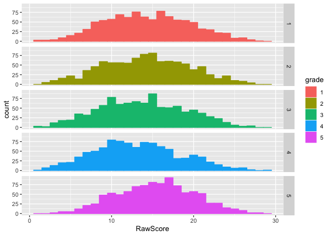
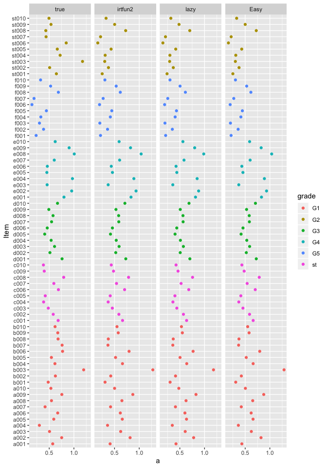
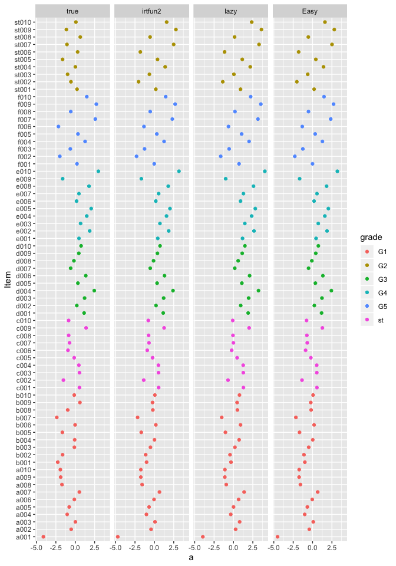
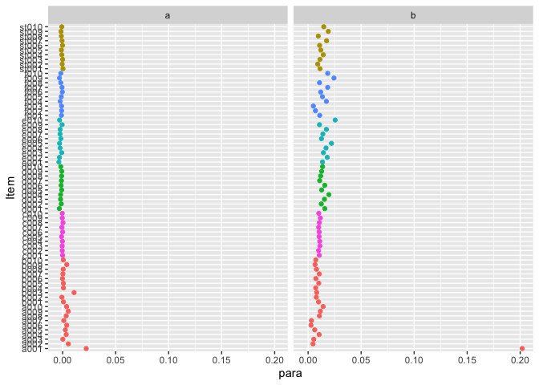
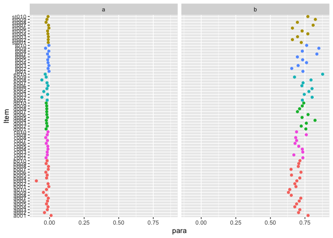
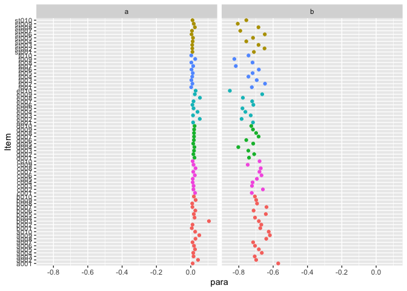
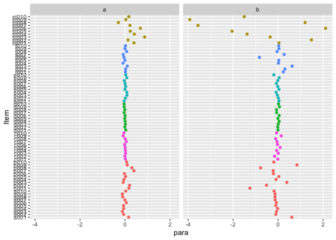
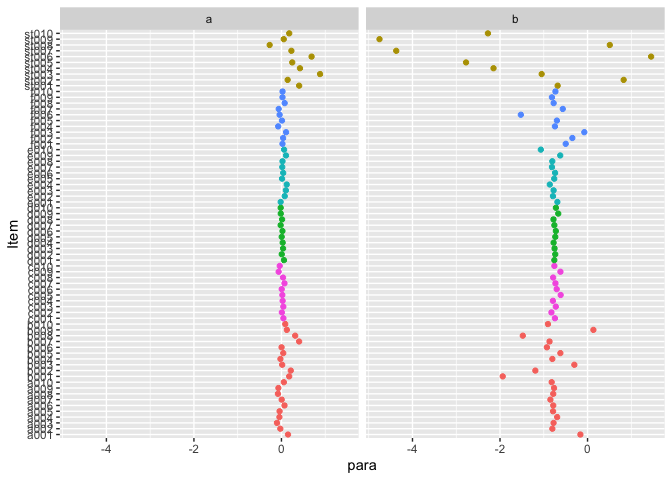

# Workstation of takuizum

20190201 Validation of irtfun2
================
T.SHIBUYA
2019/2/2
Turn to [home](index.html)

プログラム推定値の妥当性検証
============================

妥当性検証がなぜ必要か
----------------------

　IRTに限らず数値計算を実行するプログラムで重要なことは，得られている結果が本当に正しいのかどうかです。

　ソフトウェア単体であれば，収束しているかどうかや適合度，周辺対数尤度の数値の変化などを確認することで，推定プログラムがうまくいっているかどうかを知ることができます。

　しかし，より複雑なプログラムになればそれだけでは不十分であり，一見収束していても，正しい推定値が得られていないことがあります。それはプログラムの数値計算等の本質的な部分ではなく，イテレーションの範囲を指定することが間違っていたり，符号が逆だったりなど，細部の設定によるものだったりします。大抵，数値計算部分でうまくプログラムが組めていない場合，収束しなかったり，明らかにおかしな値を取るため，すぐわかります。

使用するプログラムについて
--------------------------

　`irtfun2`パッケージの`estip`の妥当性検証のためには`kazy.irt`とEasy
Estimationを使うことにします。本当であれば商用のプログラムを使いたいところですが，無料でできる範囲でやってみます。

シミュレーションデータの生成。
------------------------------

　擬似的に発生させた*θ*と識別力，困難度から２PLMにしたがって項目反応データを生成します。パラメタから反応確率を計算し，その確率と一様乱数を比較する，単純な棄却法です。`irtfun2`の`sim_gen`にも同様の方法が用いられています。

　しかし，今回は多母集団モデルに基づく推定を実行するため，少し複雑です。はじめに母集団のパラメタ(正規分布の平均とSD)を指定しておきます。

　今回想定するテストデザインは尺度化テストデザインと呼ばれるものです。通常の共通項目デザインとは異なり，全ての集団間で共通の項目を一部に含むデザインです。

    # sample data generating

    # IRT 2 PLM response probability
    ptheta2 <- function(theta, a, b){
      D <- 1.702
      1/(1+exp(-D*a*(theta-b)))
    }

    # item response probability
    resfunc2 <- function(prob){
      prob <- matrix(prob, ncol = 1)
      subfunc <- function(prob){
        if(prob < runif(1)) res <- 0
        else res <- 1
        return(res)
      }
      res <- apply(prob, 1, subfunc)
      return(res)
    }

    # theta parameter
    thetaMS <- matrix(c(-0.8,1.0,
                        -0.4,1.0,
                         0.0,1.0,
                         0.4,1.0,
                         0.8,1.0),
                      ncol = 2, byrow = T)

    # grade ID
    gradeID <- c("A","B","C","D","E")

    # true item parameter matrix
    true_para <- matrix(nrow = 30*7/3, ncol = 2)

    jj <- 1

    set.seed(0204)
    # grade item parameter
    for(g in 1:5){

      if(g == 1){ # 第一学年だけ，項目数が異なる（基準となるので）
        # item parameters(exept scaling test item)
        for(j in 1:(30*2/3)){
          true_para[jj,1] <- rlnorm(1, -0.5, 0.3)
          true_para[jj,2] <- rnorm(1, thetaMS[g,1], thetaMS[g,2])
          jj <- jj + 1 # 挿入行数カウント
        }
      } else {
        for(j in 1:(30*1/3)){
          true_para[jj,1] <- rlnorm(1, -0.5, 0.3)
          true_para[jj,2] <- rnorm(1, thetaMS[g,1], thetaMS[g,2])
          jj <- jj + 1 # 挿入行数カウント
        }
      }
    }

    # scaling test item parameter
    for(g in 1:(30*1/3)){
      true_para[jj,1] <- rlnorm(1, -1, 0.5)
      true_para[jj,2] <- runif(1, -3, 3)
      jj <- jj + 1
    }
    true_para <- data.frame(V3 = true_para[,1], V4 = true_para[,2])

    rm(jj)

    al <- c("a","b","c","d","e","f","st")
    c <- 2
    for(i in c("a","b","c","d","e")){

      num <- formatC(c(1:(30*1/3)), width = 3, flag = 0)

      if(i =="a"){
        itemn1 <- apply(matrix(i, ncol = 1), 1, paste0, num)
        itemn2 <- apply(matrix(al[c], ncol = 1), 1, paste0, num)
        itemn3 <- apply(matrix(al[7], ncol = 1), 1, paste0, num)
        itemID <- rbind(itemn1,itemn2,itemn3)
      }  

      if(i !="a") {
        itemn1 <- apply(matrix(i, ncol = 1), 1, paste0, num)
        itemn2 <- apply(matrix(al[c], ncol = 1), 1, paste0, num)
        itemn3 <- apply(matrix(al[7], ncol = 1), 1, paste0, num)
        itemn <- rbind(itemn1,itemn2,itemn3)
        itemID <- cbind(itemID,itemn)
        rm(itemn1,itemn2,itemn3,itemn,num)
      }
      c <- c + 1
    } # end of i

    rm(al,c)

    for(g in 1:5){
      if( g == 1){
        gradeitem <- c(seq.int(1,length.out = 30*2/3), seq.int(30*2 + 1, length.out = 30*1/3))
      } else {
        gradeitem <- c(seq.int(g*30*1/3+1,length.out = 30*2/3), seq.int(30*2 + 1, length.out = 30*1/3))
      }

      a <-  true_para[gradeitem, 1]
      b <-  true_para[gradeitem, 2]

      # ability parameter
      theta <- rnorm(1000, thetaMS[g,1], thetaMS[g,2])

      # generate response patterns exept scaling test item
      resp <- theta %>%
        matrix(ncol = 1) %>%
        apply(1,ptheta2, a = a, b = b) %>%
        apply(2,resfunc2) %>%
        t() %>%
        as.data.frame()

      colnames(resp) <- itemID[,g]

      grade <- rep(g, 1000) %>% as.numeric() # グループIDはnumeric型であること。

      ID <- apply(matrix(gradeID[g], ncol = 1), 1, paste0,
                  formatC(c(1:1000), width = 5, flag = 0)) %>%
        as.character()

      resp <- cbind(ID, grade, resp)

      if(g == 1) {
        RESP <- resp
      } else {
        # combine response data for concurrent calibration
        RESP %<>% dplyr::full_join(resp) %>% suppressWarnings() %>% suppressMessages()
      }

    } # end of one grade

    Joining, by = c("ID", "grade", "b001", "b002", "b003", "b004", "b005", "b006", "b007", "b008", "b009", "b010", "st001", "st002", "st003", "st004", "st005", "st006", "st007", "st008", "st009", "st010")

    Warning: Column `ID` joining factors with different levels, coercing to
    character vector

    Joining, by = c("ID", "grade", "st001", "st002", "st003", "st004", "st005", "st006", "st007", "st008", "st009", "st010", "c001", "c002", "c003", "c004", "c005", "c006", "c007", "c008", "c009", "c010")

    Warning: Column `ID` joining character vector and factor, coercing into
    character vector

    Joining, by = c("ID", "grade", "st001", "st002", "st003", "st004", "st005", "st006", "st007", "st008", "st009", "st010", "d001", "d002", "d003", "d004", "d005", "d006", "d007", "d008", "d009", "d010")

    Warning: Column `ID` joining character vector and factor, coercing into
    character vector

    Joining, by = c("ID", "grade", "st001", "st002", "st003", "st004", "st005", "st006", "st007", "st008", "st009", "st010", "e001", "e002", "e003", "e004", "e005", "e006", "e007", "e008", "e009", "e010")

    Warning: Column `ID` joining character vector and factor, coercing into
    character vector

    rm(a,b,g,grade,gradeID,gradeitem,i,ID,j,theta,itemID,resp)

    RESP2 <- RESP
    RESP2$grade <- matrix(c(3,2,1,4,5)) %>% apply(1, rep.int, times = 1000) %>% as.vector()

    # Output response data for Easy Estimation
    write.table(RESP2, file="vald_data.dat", quote = F, sep = "", col.names = F, row.names = F, na="N")

    true_para <- data.frame(a=true_para$V3, b=true_para$V4)

    RESP %>% head(10) %>% knitr::kable(format = "markdown")

<table style="width:100%;">
<colgroup>
<col style="width: 1%" />
<col style="width: 1%" />
<col style="width: 1%" />
<col style="width: 1%" />
<col style="width: 1%" />
<col style="width: 1%" />
<col style="width: 1%" />
<col style="width: 1%" />
<col style="width: 1%" />
<col style="width: 1%" />
<col style="width: 1%" />
<col style="width: 1%" />
<col style="width: 1%" />
<col style="width: 1%" />
<col style="width: 1%" />
<col style="width: 1%" />
<col style="width: 1%" />
<col style="width: 1%" />
<col style="width: 1%" />
<col style="width: 1%" />
<col style="width: 1%" />
<col style="width: 1%" />
<col style="width: 1%" />
<col style="width: 1%" />
<col style="width: 1%" />
<col style="width: 1%" />
<col style="width: 1%" />
<col style="width: 1%" />
<col style="width: 1%" />
<col style="width: 1%" />
<col style="width: 1%" />
<col style="width: 1%" />
<col style="width: 1%" />
<col style="width: 1%" />
<col style="width: 1%" />
<col style="width: 1%" />
<col style="width: 1%" />
<col style="width: 1%" />
<col style="width: 1%" />
<col style="width: 1%" />
<col style="width: 1%" />
<col style="width: 1%" />
<col style="width: 1%" />
<col style="width: 1%" />
<col style="width: 1%" />
<col style="width: 1%" />
<col style="width: 1%" />
<col style="width: 1%" />
<col style="width: 1%" />
<col style="width: 1%" />
<col style="width: 1%" />
<col style="width: 1%" />
<col style="width: 1%" />
<col style="width: 1%" />
<col style="width: 1%" />
<col style="width: 1%" />
<col style="width: 1%" />
<col style="width: 1%" />
<col style="width: 1%" />
<col style="width: 1%" />
<col style="width: 1%" />
<col style="width: 1%" />
<col style="width: 1%" />
<col style="width: 1%" />
<col style="width: 1%" />
<col style="width: 1%" />
<col style="width: 1%" />
<col style="width: 1%" />
<col style="width: 1%" />
<col style="width: 1%" />
<col style="width: 1%" />
<col style="width: 1%" />
</colgroup>
<thead>
<tr class="header">
<th style="text-align: left;">ID</th>
<th style="text-align: right;">grade</th>
<th style="text-align: right;">a001</th>
<th style="text-align: right;">a002</th>
<th style="text-align: right;">a003</th>
<th style="text-align: right;">a004</th>
<th style="text-align: right;">a005</th>
<th style="text-align: right;">a006</th>
<th style="text-align: right;">a007</th>
<th style="text-align: right;">a008</th>
<th style="text-align: right;">a009</th>
<th style="text-align: right;">a010</th>
<th style="text-align: right;">b001</th>
<th style="text-align: right;">b002</th>
<th style="text-align: right;">b003</th>
<th style="text-align: right;">b004</th>
<th style="text-align: right;">b005</th>
<th style="text-align: right;">b006</th>
<th style="text-align: right;">b007</th>
<th style="text-align: right;">b008</th>
<th style="text-align: right;">b009</th>
<th style="text-align: right;">b010</th>
<th style="text-align: right;">st001</th>
<th style="text-align: right;">st002</th>
<th style="text-align: right;">st003</th>
<th style="text-align: right;">st004</th>
<th style="text-align: right;">st005</th>
<th style="text-align: right;">st006</th>
<th style="text-align: right;">st007</th>
<th style="text-align: right;">st008</th>
<th style="text-align: right;">st009</th>
<th style="text-align: right;">st010</th>
<th style="text-align: right;">c001</th>
<th style="text-align: right;">c002</th>
<th style="text-align: right;">c003</th>
<th style="text-align: right;">c004</th>
<th style="text-align: right;">c005</th>
<th style="text-align: right;">c006</th>
<th style="text-align: right;">c007</th>
<th style="text-align: right;">c008</th>
<th style="text-align: right;">c009</th>
<th style="text-align: right;">c010</th>
<th style="text-align: right;">d001</th>
<th style="text-align: right;">d002</th>
<th style="text-align: right;">d003</th>
<th style="text-align: right;">d004</th>
<th style="text-align: right;">d005</th>
<th style="text-align: right;">d006</th>
<th style="text-align: right;">d007</th>
<th style="text-align: right;">d008</th>
<th style="text-align: right;">d009</th>
<th style="text-align: right;">d010</th>
<th style="text-align: right;">e001</th>
<th style="text-align: right;">e002</th>
<th style="text-align: right;">e003</th>
<th style="text-align: right;">e004</th>
<th style="text-align: right;">e005</th>
<th style="text-align: right;">e006</th>
<th style="text-align: right;">e007</th>
<th style="text-align: right;">e008</th>
<th style="text-align: right;">e009</th>
<th style="text-align: right;">e010</th>
<th style="text-align: right;">f001</th>
<th style="text-align: right;">f002</th>
<th style="text-align: right;">f003</th>
<th style="text-align: right;">f004</th>
<th style="text-align: right;">f005</th>
<th style="text-align: right;">f006</th>
<th style="text-align: right;">f007</th>
<th style="text-align: right;">f008</th>
<th style="text-align: right;">f009</th>
<th style="text-align: right;">f010</th>
</tr>
</thead>
<tbody>
<tr class="odd">
<td style="text-align: left;">A00001</td>
<td style="text-align: right;">1</td>
<td style="text-align: right;">1</td>
<td style="text-align: right;">1</td>
<td style="text-align: right;">0</td>
<td style="text-align: right;">1</td>
<td style="text-align: right;">1</td>
<td style="text-align: right;">0</td>
<td style="text-align: right;">0</td>
<td style="text-align: right;">1</td>
<td style="text-align: right;">1</td>
<td style="text-align: right;">1</td>
<td style="text-align: right;">1</td>
<td style="text-align: right;">1</td>
<td style="text-align: right;">1</td>
<td style="text-align: right;">0</td>
<td style="text-align: right;">1</td>
<td style="text-align: right;">0</td>
<td style="text-align: right;">0</td>
<td style="text-align: right;">1</td>
<td style="text-align: right;">1</td>
<td style="text-align: right;">1</td>
<td style="text-align: right;">0</td>
<td style="text-align: right;">0</td>
<td style="text-align: right;">0</td>
<td style="text-align: right;">0</td>
<td style="text-align: right;">0</td>
<td style="text-align: right;">1</td>
<td style="text-align: right;">0</td>
<td style="text-align: right;">1</td>
<td style="text-align: right;">0</td>
<td style="text-align: right;">0</td>
<td style="text-align: right;">NA</td>
<td style="text-align: right;">NA</td>
<td style="text-align: right;">NA</td>
<td style="text-align: right;">NA</td>
<td style="text-align: right;">NA</td>
<td style="text-align: right;">NA</td>
<td style="text-align: right;">NA</td>
<td style="text-align: right;">NA</td>
<td style="text-align: right;">NA</td>
<td style="text-align: right;">NA</td>
<td style="text-align: right;">NA</td>
<td style="text-align: right;">NA</td>
<td style="text-align: right;">NA</td>
<td style="text-align: right;">NA</td>
<td style="text-align: right;">NA</td>
<td style="text-align: right;">NA</td>
<td style="text-align: right;">NA</td>
<td style="text-align: right;">NA</td>
<td style="text-align: right;">NA</td>
<td style="text-align: right;">NA</td>
<td style="text-align: right;">NA</td>
<td style="text-align: right;">NA</td>
<td style="text-align: right;">NA</td>
<td style="text-align: right;">NA</td>
<td style="text-align: right;">NA</td>
<td style="text-align: right;">NA</td>
<td style="text-align: right;">NA</td>
<td style="text-align: right;">NA</td>
<td style="text-align: right;">NA</td>
<td style="text-align: right;">NA</td>
<td style="text-align: right;">NA</td>
<td style="text-align: right;">NA</td>
<td style="text-align: right;">NA</td>
<td style="text-align: right;">NA</td>
<td style="text-align: right;">NA</td>
<td style="text-align: right;">NA</td>
<td style="text-align: right;">NA</td>
<td style="text-align: right;">NA</td>
<td style="text-align: right;">NA</td>
<td style="text-align: right;">NA</td>
</tr>
<tr class="even">
<td style="text-align: left;">A00002</td>
<td style="text-align: right;">1</td>
<td style="text-align: right;">1</td>
<td style="text-align: right;">0</td>
<td style="text-align: right;">0</td>
<td style="text-align: right;">1</td>
<td style="text-align: right;">0</td>
<td style="text-align: right;">0</td>
<td style="text-align: right;">0</td>
<td style="text-align: right;">0</td>
<td style="text-align: right;">0</td>
<td style="text-align: right;">1</td>
<td style="text-align: right;">1</td>
<td style="text-align: right;">0</td>
<td style="text-align: right;">0</td>
<td style="text-align: right;">0</td>
<td style="text-align: right;">0</td>
<td style="text-align: right;">0</td>
<td style="text-align: right;">1</td>
<td style="text-align: right;">0</td>
<td style="text-align: right;">0</td>
<td style="text-align: right;">0</td>
<td style="text-align: right;">0</td>
<td style="text-align: right;">0</td>
<td style="text-align: right;">1</td>
<td style="text-align: right;">0</td>
<td style="text-align: right;">0</td>
<td style="text-align: right;">0</td>
<td style="text-align: right;">1</td>
<td style="text-align: right;">0</td>
<td style="text-align: right;">0</td>
<td style="text-align: right;">0</td>
<td style="text-align: right;">NA</td>
<td style="text-align: right;">NA</td>
<td style="text-align: right;">NA</td>
<td style="text-align: right;">NA</td>
<td style="text-align: right;">NA</td>
<td style="text-align: right;">NA</td>
<td style="text-align: right;">NA</td>
<td style="text-align: right;">NA</td>
<td style="text-align: right;">NA</td>
<td style="text-align: right;">NA</td>
<td style="text-align: right;">NA</td>
<td style="text-align: right;">NA</td>
<td style="text-align: right;">NA</td>
<td style="text-align: right;">NA</td>
<td style="text-align: right;">NA</td>
<td style="text-align: right;">NA</td>
<td style="text-align: right;">NA</td>
<td style="text-align: right;">NA</td>
<td style="text-align: right;">NA</td>
<td style="text-align: right;">NA</td>
<td style="text-align: right;">NA</td>
<td style="text-align: right;">NA</td>
<td style="text-align: right;">NA</td>
<td style="text-align: right;">NA</td>
<td style="text-align: right;">NA</td>
<td style="text-align: right;">NA</td>
<td style="text-align: right;">NA</td>
<td style="text-align: right;">NA</td>
<td style="text-align: right;">NA</td>
<td style="text-align: right;">NA</td>
<td style="text-align: right;">NA</td>
<td style="text-align: right;">NA</td>
<td style="text-align: right;">NA</td>
<td style="text-align: right;">NA</td>
<td style="text-align: right;">NA</td>
<td style="text-align: right;">NA</td>
<td style="text-align: right;">NA</td>
<td style="text-align: right;">NA</td>
<td style="text-align: right;">NA</td>
<td style="text-align: right;">NA</td>
</tr>
<tr class="odd">
<td style="text-align: left;">A00003</td>
<td style="text-align: right;">1</td>
<td style="text-align: right;">1</td>
<td style="text-align: right;">1</td>
<td style="text-align: right;">1</td>
<td style="text-align: right;">0</td>
<td style="text-align: right;">0</td>
<td style="text-align: right;">0</td>
<td style="text-align: right;">0</td>
<td style="text-align: right;">1</td>
<td style="text-align: right;">1</td>
<td style="text-align: right;">1</td>
<td style="text-align: right;">1</td>
<td style="text-align: right;">0</td>
<td style="text-align: right;">1</td>
<td style="text-align: right;">1</td>
<td style="text-align: right;">1</td>
<td style="text-align: right;">0</td>
<td style="text-align: right;">1</td>
<td style="text-align: right;">1</td>
<td style="text-align: right;">0</td>
<td style="text-align: right;">0</td>
<td style="text-align: right;">0</td>
<td style="text-align: right;">1</td>
<td style="text-align: right;">0</td>
<td style="text-align: right;">0</td>
<td style="text-align: right;">0</td>
<td style="text-align: right;">0</td>
<td style="text-align: right;">1</td>
<td style="text-align: right;">0</td>
<td style="text-align: right;">0</td>
<td style="text-align: right;">0</td>
<td style="text-align: right;">NA</td>
<td style="text-align: right;">NA</td>
<td style="text-align: right;">NA</td>
<td style="text-align: right;">NA</td>
<td style="text-align: right;">NA</td>
<td style="text-align: right;">NA</td>
<td style="text-align: right;">NA</td>
<td style="text-align: right;">NA</td>
<td style="text-align: right;">NA</td>
<td style="text-align: right;">NA</td>
<td style="text-align: right;">NA</td>
<td style="text-align: right;">NA</td>
<td style="text-align: right;">NA</td>
<td style="text-align: right;">NA</td>
<td style="text-align: right;">NA</td>
<td style="text-align: right;">NA</td>
<td style="text-align: right;">NA</td>
<td style="text-align: right;">NA</td>
<td style="text-align: right;">NA</td>
<td style="text-align: right;">NA</td>
<td style="text-align: right;">NA</td>
<td style="text-align: right;">NA</td>
<td style="text-align: right;">NA</td>
<td style="text-align: right;">NA</td>
<td style="text-align: right;">NA</td>
<td style="text-align: right;">NA</td>
<td style="text-align: right;">NA</td>
<td style="text-align: right;">NA</td>
<td style="text-align: right;">NA</td>
<td style="text-align: right;">NA</td>
<td style="text-align: right;">NA</td>
<td style="text-align: right;">NA</td>
<td style="text-align: right;">NA</td>
<td style="text-align: right;">NA</td>
<td style="text-align: right;">NA</td>
<td style="text-align: right;">NA</td>
<td style="text-align: right;">NA</td>
<td style="text-align: right;">NA</td>
<td style="text-align: right;">NA</td>
<td style="text-align: right;">NA</td>
</tr>
<tr class="even">
<td style="text-align: left;">A00004</td>
<td style="text-align: right;">1</td>
<td style="text-align: right;">1</td>
<td style="text-align: right;">0</td>
<td style="text-align: right;">0</td>
<td style="text-align: right;">0</td>
<td style="text-align: right;">0</td>
<td style="text-align: right;">0</td>
<td style="text-align: right;">0</td>
<td style="text-align: right;">1</td>
<td style="text-align: right;">0</td>
<td style="text-align: right;">1</td>
<td style="text-align: right;">1</td>
<td style="text-align: right;">1</td>
<td style="text-align: right;">0</td>
<td style="text-align: right;">0</td>
<td style="text-align: right;">0</td>
<td style="text-align: right;">0</td>
<td style="text-align: right;">1</td>
<td style="text-align: right;">0</td>
<td style="text-align: right;">0</td>
<td style="text-align: right;">0</td>
<td style="text-align: right;">0</td>
<td style="text-align: right;">0</td>
<td style="text-align: right;">1</td>
<td style="text-align: right;">0</td>
<td style="text-align: right;">0</td>
<td style="text-align: right;">0</td>
<td style="text-align: right;">0</td>
<td style="text-align: right;">0</td>
<td style="text-align: right;">0</td>
<td style="text-align: right;">1</td>
<td style="text-align: right;">NA</td>
<td style="text-align: right;">NA</td>
<td style="text-align: right;">NA</td>
<td style="text-align: right;">NA</td>
<td style="text-align: right;">NA</td>
<td style="text-align: right;">NA</td>
<td style="text-align: right;">NA</td>
<td style="text-align: right;">NA</td>
<td style="text-align: right;">NA</td>
<td style="text-align: right;">NA</td>
<td style="text-align: right;">NA</td>
<td style="text-align: right;">NA</td>
<td style="text-align: right;">NA</td>
<td style="text-align: right;">NA</td>
<td style="text-align: right;">NA</td>
<td style="text-align: right;">NA</td>
<td style="text-align: right;">NA</td>
<td style="text-align: right;">NA</td>
<td style="text-align: right;">NA</td>
<td style="text-align: right;">NA</td>
<td style="text-align: right;">NA</td>
<td style="text-align: right;">NA</td>
<td style="text-align: right;">NA</td>
<td style="text-align: right;">NA</td>
<td style="text-align: right;">NA</td>
<td style="text-align: right;">NA</td>
<td style="text-align: right;">NA</td>
<td style="text-align: right;">NA</td>
<td style="text-align: right;">NA</td>
<td style="text-align: right;">NA</td>
<td style="text-align: right;">NA</td>
<td style="text-align: right;">NA</td>
<td style="text-align: right;">NA</td>
<td style="text-align: right;">NA</td>
<td style="text-align: right;">NA</td>
<td style="text-align: right;">NA</td>
<td style="text-align: right;">NA</td>
<td style="text-align: right;">NA</td>
<td style="text-align: right;">NA</td>
<td style="text-align: right;">NA</td>
</tr>
<tr class="odd">
<td style="text-align: left;">A00005</td>
<td style="text-align: right;">1</td>
<td style="text-align: right;">1</td>
<td style="text-align: right;">0</td>
<td style="text-align: right;">1</td>
<td style="text-align: right;">1</td>
<td style="text-align: right;">0</td>
<td style="text-align: right;">1</td>
<td style="text-align: right;">1</td>
<td style="text-align: right;">1</td>
<td style="text-align: right;">1</td>
<td style="text-align: right;">1</td>
<td style="text-align: right;">1</td>
<td style="text-align: right;">1</td>
<td style="text-align: right;">1</td>
<td style="text-align: right;">0</td>
<td style="text-align: right;">1</td>
<td style="text-align: right;">0</td>
<td style="text-align: right;">1</td>
<td style="text-align: right;">1</td>
<td style="text-align: right;">0</td>
<td style="text-align: right;">0</td>
<td style="text-align: right;">1</td>
<td style="text-align: right;">1</td>
<td style="text-align: right;">1</td>
<td style="text-align: right;">1</td>
<td style="text-align: right;">1</td>
<td style="text-align: right;">1</td>
<td style="text-align: right;">0</td>
<td style="text-align: right;">1</td>
<td style="text-align: right;">0</td>
<td style="text-align: right;">1</td>
<td style="text-align: right;">NA</td>
<td style="text-align: right;">NA</td>
<td style="text-align: right;">NA</td>
<td style="text-align: right;">NA</td>
<td style="text-align: right;">NA</td>
<td style="text-align: right;">NA</td>
<td style="text-align: right;">NA</td>
<td style="text-align: right;">NA</td>
<td style="text-align: right;">NA</td>
<td style="text-align: right;">NA</td>
<td style="text-align: right;">NA</td>
<td style="text-align: right;">NA</td>
<td style="text-align: right;">NA</td>
<td style="text-align: right;">NA</td>
<td style="text-align: right;">NA</td>
<td style="text-align: right;">NA</td>
<td style="text-align: right;">NA</td>
<td style="text-align: right;">NA</td>
<td style="text-align: right;">NA</td>
<td style="text-align: right;">NA</td>
<td style="text-align: right;">NA</td>
<td style="text-align: right;">NA</td>
<td style="text-align: right;">NA</td>
<td style="text-align: right;">NA</td>
<td style="text-align: right;">NA</td>
<td style="text-align: right;">NA</td>
<td style="text-align: right;">NA</td>
<td style="text-align: right;">NA</td>
<td style="text-align: right;">NA</td>
<td style="text-align: right;">NA</td>
<td style="text-align: right;">NA</td>
<td style="text-align: right;">NA</td>
<td style="text-align: right;">NA</td>
<td style="text-align: right;">NA</td>
<td style="text-align: right;">NA</td>
<td style="text-align: right;">NA</td>
<td style="text-align: right;">NA</td>
<td style="text-align: right;">NA</td>
<td style="text-align: right;">NA</td>
<td style="text-align: right;">NA</td>
</tr>
<tr class="even">
<td style="text-align: left;">A00006</td>
<td style="text-align: right;">1</td>
<td style="text-align: right;">1</td>
<td style="text-align: right;">1</td>
<td style="text-align: right;">0</td>
<td style="text-align: right;">1</td>
<td style="text-align: right;">0</td>
<td style="text-align: right;">1</td>
<td style="text-align: right;">0</td>
<td style="text-align: right;">1</td>
<td style="text-align: right;">1</td>
<td style="text-align: right;">0</td>
<td style="text-align: right;">1</td>
<td style="text-align: right;">1</td>
<td style="text-align: right;">0</td>
<td style="text-align: right;">0</td>
<td style="text-align: right;">1</td>
<td style="text-align: right;">0</td>
<td style="text-align: right;">1</td>
<td style="text-align: right;">1</td>
<td style="text-align: right;">1</td>
<td style="text-align: right;">0</td>
<td style="text-align: right;">0</td>
<td style="text-align: right;">1</td>
<td style="text-align: right;">1</td>
<td style="text-align: right;">0</td>
<td style="text-align: right;">1</td>
<td style="text-align: right;">1</td>
<td style="text-align: right;">0</td>
<td style="text-align: right;">1</td>
<td style="text-align: right;">0</td>
<td style="text-align: right;">0</td>
<td style="text-align: right;">NA</td>
<td style="text-align: right;">NA</td>
<td style="text-align: right;">NA</td>
<td style="text-align: right;">NA</td>
<td style="text-align: right;">NA</td>
<td style="text-align: right;">NA</td>
<td style="text-align: right;">NA</td>
<td style="text-align: right;">NA</td>
<td style="text-align: right;">NA</td>
<td style="text-align: right;">NA</td>
<td style="text-align: right;">NA</td>
<td style="text-align: right;">NA</td>
<td style="text-align: right;">NA</td>
<td style="text-align: right;">NA</td>
<td style="text-align: right;">NA</td>
<td style="text-align: right;">NA</td>
<td style="text-align: right;">NA</td>
<td style="text-align: right;">NA</td>
<td style="text-align: right;">NA</td>
<td style="text-align: right;">NA</td>
<td style="text-align: right;">NA</td>
<td style="text-align: right;">NA</td>
<td style="text-align: right;">NA</td>
<td style="text-align: right;">NA</td>
<td style="text-align: right;">NA</td>
<td style="text-align: right;">NA</td>
<td style="text-align: right;">NA</td>
<td style="text-align: right;">NA</td>
<td style="text-align: right;">NA</td>
<td style="text-align: right;">NA</td>
<td style="text-align: right;">NA</td>
<td style="text-align: right;">NA</td>
<td style="text-align: right;">NA</td>
<td style="text-align: right;">NA</td>
<td style="text-align: right;">NA</td>
<td style="text-align: right;">NA</td>
<td style="text-align: right;">NA</td>
<td style="text-align: right;">NA</td>
<td style="text-align: right;">NA</td>
<td style="text-align: right;">NA</td>
</tr>
<tr class="odd">
<td style="text-align: left;">A00007</td>
<td style="text-align: right;">1</td>
<td style="text-align: right;">1</td>
<td style="text-align: right;">1</td>
<td style="text-align: right;">1</td>
<td style="text-align: right;">1</td>
<td style="text-align: right;">1</td>
<td style="text-align: right;">0</td>
<td style="text-align: right;">0</td>
<td style="text-align: right;">1</td>
<td style="text-align: right;">1</td>
<td style="text-align: right;">0</td>
<td style="text-align: right;">1</td>
<td style="text-align: right;">1</td>
<td style="text-align: right;">1</td>
<td style="text-align: right;">1</td>
<td style="text-align: right;">1</td>
<td style="text-align: right;">1</td>
<td style="text-align: right;">1</td>
<td style="text-align: right;">0</td>
<td style="text-align: right;">0</td>
<td style="text-align: right;">1</td>
<td style="text-align: right;">0</td>
<td style="text-align: right;">1</td>
<td style="text-align: right;">1</td>
<td style="text-align: right;">0</td>
<td style="text-align: right;">1</td>
<td style="text-align: right;">1</td>
<td style="text-align: right;">0</td>
<td style="text-align: right;">1</td>
<td style="text-align: right;">0</td>
<td style="text-align: right;">0</td>
<td style="text-align: right;">NA</td>
<td style="text-align: right;">NA</td>
<td style="text-align: right;">NA</td>
<td style="text-align: right;">NA</td>
<td style="text-align: right;">NA</td>
<td style="text-align: right;">NA</td>
<td style="text-align: right;">NA</td>
<td style="text-align: right;">NA</td>
<td style="text-align: right;">NA</td>
<td style="text-align: right;">NA</td>
<td style="text-align: right;">NA</td>
<td style="text-align: right;">NA</td>
<td style="text-align: right;">NA</td>
<td style="text-align: right;">NA</td>
<td style="text-align: right;">NA</td>
<td style="text-align: right;">NA</td>
<td style="text-align: right;">NA</td>
<td style="text-align: right;">NA</td>
<td style="text-align: right;">NA</td>
<td style="text-align: right;">NA</td>
<td style="text-align: right;">NA</td>
<td style="text-align: right;">NA</td>
<td style="text-align: right;">NA</td>
<td style="text-align: right;">NA</td>
<td style="text-align: right;">NA</td>
<td style="text-align: right;">NA</td>
<td style="text-align: right;">NA</td>
<td style="text-align: right;">NA</td>
<td style="text-align: right;">NA</td>
<td style="text-align: right;">NA</td>
<td style="text-align: right;">NA</td>
<td style="text-align: right;">NA</td>
<td style="text-align: right;">NA</td>
<td style="text-align: right;">NA</td>
<td style="text-align: right;">NA</td>
<td style="text-align: right;">NA</td>
<td style="text-align: right;">NA</td>
<td style="text-align: right;">NA</td>
<td style="text-align: right;">NA</td>
<td style="text-align: right;">NA</td>
</tr>
<tr class="even">
<td style="text-align: left;">A00008</td>
<td style="text-align: right;">1</td>
<td style="text-align: right;">1</td>
<td style="text-align: right;">1</td>
<td style="text-align: right;">0</td>
<td style="text-align: right;">0</td>
<td style="text-align: right;">0</td>
<td style="text-align: right;">0</td>
<td style="text-align: right;">0</td>
<td style="text-align: right;">1</td>
<td style="text-align: right;">1</td>
<td style="text-align: right;">0</td>
<td style="text-align: right;">1</td>
<td style="text-align: right;">1</td>
<td style="text-align: right;">0</td>
<td style="text-align: right;">1</td>
<td style="text-align: right;">1</td>
<td style="text-align: right;">1</td>
<td style="text-align: right;">1</td>
<td style="text-align: right;">0</td>
<td style="text-align: right;">0</td>
<td style="text-align: right;">0</td>
<td style="text-align: right;">0</td>
<td style="text-align: right;">1</td>
<td style="text-align: right;">1</td>
<td style="text-align: right;">0</td>
<td style="text-align: right;">1</td>
<td style="text-align: right;">0</td>
<td style="text-align: right;">0</td>
<td style="text-align: right;">0</td>
<td style="text-align: right;">0</td>
<td style="text-align: right;">0</td>
<td style="text-align: right;">NA</td>
<td style="text-align: right;">NA</td>
<td style="text-align: right;">NA</td>
<td style="text-align: right;">NA</td>
<td style="text-align: right;">NA</td>
<td style="text-align: right;">NA</td>
<td style="text-align: right;">NA</td>
<td style="text-align: right;">NA</td>
<td style="text-align: right;">NA</td>
<td style="text-align: right;">NA</td>
<td style="text-align: right;">NA</td>
<td style="text-align: right;">NA</td>
<td style="text-align: right;">NA</td>
<td style="text-align: right;">NA</td>
<td style="text-align: right;">NA</td>
<td style="text-align: right;">NA</td>
<td style="text-align: right;">NA</td>
<td style="text-align: right;">NA</td>
<td style="text-align: right;">NA</td>
<td style="text-align: right;">NA</td>
<td style="text-align: right;">NA</td>
<td style="text-align: right;">NA</td>
<td style="text-align: right;">NA</td>
<td style="text-align: right;">NA</td>
<td style="text-align: right;">NA</td>
<td style="text-align: right;">NA</td>
<td style="text-align: right;">NA</td>
<td style="text-align: right;">NA</td>
<td style="text-align: right;">NA</td>
<td style="text-align: right;">NA</td>
<td style="text-align: right;">NA</td>
<td style="text-align: right;">NA</td>
<td style="text-align: right;">NA</td>
<td style="text-align: right;">NA</td>
<td style="text-align: right;">NA</td>
<td style="text-align: right;">NA</td>
<td style="text-align: right;">NA</td>
<td style="text-align: right;">NA</td>
<td style="text-align: right;">NA</td>
<td style="text-align: right;">NA</td>
</tr>
<tr class="odd">
<td style="text-align: left;">A00009</td>
<td style="text-align: right;">1</td>
<td style="text-align: right;">1</td>
<td style="text-align: right;">1</td>
<td style="text-align: right;">1</td>
<td style="text-align: right;">1</td>
<td style="text-align: right;">1</td>
<td style="text-align: right;">1</td>
<td style="text-align: right;">0</td>
<td style="text-align: right;">1</td>
<td style="text-align: right;">1</td>
<td style="text-align: right;">1</td>
<td style="text-align: right;">1</td>
<td style="text-align: right;">1</td>
<td style="text-align: right;">1</td>
<td style="text-align: right;">1</td>
<td style="text-align: right;">1</td>
<td style="text-align: right;">1</td>
<td style="text-align: right;">1</td>
<td style="text-align: right;">1</td>
<td style="text-align: right;">0</td>
<td style="text-align: right;">0</td>
<td style="text-align: right;">1</td>
<td style="text-align: right;">1</td>
<td style="text-align: right;">0</td>
<td style="text-align: right;">1</td>
<td style="text-align: right;">1</td>
<td style="text-align: right;">1</td>
<td style="text-align: right;">0</td>
<td style="text-align: right;">1</td>
<td style="text-align: right;">0</td>
<td style="text-align: right;">0</td>
<td style="text-align: right;">NA</td>
<td style="text-align: right;">NA</td>
<td style="text-align: right;">NA</td>
<td style="text-align: right;">NA</td>
<td style="text-align: right;">NA</td>
<td style="text-align: right;">NA</td>
<td style="text-align: right;">NA</td>
<td style="text-align: right;">NA</td>
<td style="text-align: right;">NA</td>
<td style="text-align: right;">NA</td>
<td style="text-align: right;">NA</td>
<td style="text-align: right;">NA</td>
<td style="text-align: right;">NA</td>
<td style="text-align: right;">NA</td>
<td style="text-align: right;">NA</td>
<td style="text-align: right;">NA</td>
<td style="text-align: right;">NA</td>
<td style="text-align: right;">NA</td>
<td style="text-align: right;">NA</td>
<td style="text-align: right;">NA</td>
<td style="text-align: right;">NA</td>
<td style="text-align: right;">NA</td>
<td style="text-align: right;">NA</td>
<td style="text-align: right;">NA</td>
<td style="text-align: right;">NA</td>
<td style="text-align: right;">NA</td>
<td style="text-align: right;">NA</td>
<td style="text-align: right;">NA</td>
<td style="text-align: right;">NA</td>
<td style="text-align: right;">NA</td>
<td style="text-align: right;">NA</td>
<td style="text-align: right;">NA</td>
<td style="text-align: right;">NA</td>
<td style="text-align: right;">NA</td>
<td style="text-align: right;">NA</td>
<td style="text-align: right;">NA</td>
<td style="text-align: right;">NA</td>
<td style="text-align: right;">NA</td>
<td style="text-align: right;">NA</td>
<td style="text-align: right;">NA</td>
</tr>
<tr class="even">
<td style="text-align: left;">A00010</td>
<td style="text-align: right;">1</td>
<td style="text-align: right;">1</td>
<td style="text-align: right;">0</td>
<td style="text-align: right;">0</td>
<td style="text-align: right;">0</td>
<td style="text-align: right;">0</td>
<td style="text-align: right;">1</td>
<td style="text-align: right;">0</td>
<td style="text-align: right;">0</td>
<td style="text-align: right;">1</td>
<td style="text-align: right;">0</td>
<td style="text-align: right;">0</td>
<td style="text-align: right;">1</td>
<td style="text-align: right;">0</td>
<td style="text-align: right;">0</td>
<td style="text-align: right;">1</td>
<td style="text-align: right;">0</td>
<td style="text-align: right;">1</td>
<td style="text-align: right;">0</td>
<td style="text-align: right;">0</td>
<td style="text-align: right;">0</td>
<td style="text-align: right;">0</td>
<td style="text-align: right;">0</td>
<td style="text-align: right;">0</td>
<td style="text-align: right;">1</td>
<td style="text-align: right;">0</td>
<td style="text-align: right;">0</td>
<td style="text-align: right;">0</td>
<td style="text-align: right;">1</td>
<td style="text-align: right;">0</td>
<td style="text-align: right;">0</td>
<td style="text-align: right;">NA</td>
<td style="text-align: right;">NA</td>
<td style="text-align: right;">NA</td>
<td style="text-align: right;">NA</td>
<td style="text-align: right;">NA</td>
<td style="text-align: right;">NA</td>
<td style="text-align: right;">NA</td>
<td style="text-align: right;">NA</td>
<td style="text-align: right;">NA</td>
<td style="text-align: right;">NA</td>
<td style="text-align: right;">NA</td>
<td style="text-align: right;">NA</td>
<td style="text-align: right;">NA</td>
<td style="text-align: right;">NA</td>
<td style="text-align: right;">NA</td>
<td style="text-align: right;">NA</td>
<td style="text-align: right;">NA</td>
<td style="text-align: right;">NA</td>
<td style="text-align: right;">NA</td>
<td style="text-align: right;">NA</td>
<td style="text-align: right;">NA</td>
<td style="text-align: right;">NA</td>
<td style="text-align: right;">NA</td>
<td style="text-align: right;">NA</td>
<td style="text-align: right;">NA</td>
<td style="text-align: right;">NA</td>
<td style="text-align: right;">NA</td>
<td style="text-align: right;">NA</td>
<td style="text-align: right;">NA</td>
<td style="text-align: right;">NA</td>
<td style="text-align: right;">NA</td>
<td style="text-align: right;">NA</td>
<td style="text-align: right;">NA</td>
<td style="text-align: right;">NA</td>
<td style="text-align: right;">NA</td>
<td style="text-align: right;">NA</td>
<td style="text-align: right;">NA</td>
<td style="text-align: right;">NA</td>
<td style="text-align: right;">NA</td>
<td style="text-align: right;">NA</td>
</tr>
</tbody>
</table>

### 学年ごとに素点のヒストグラムを描画

　こんな感じのデータを作りました。

    hist_dat <- data.frame(grade=RESP$grade %>% as.character())
    hist_dat$RawScore = rowSums(RESP[,c(-1,-2)], na.rm = T)
    hist_dat %>% ggplot(aes(x=RawScore, fill=grade, colour=grade)) + geom_histogram(binwidth = 1) + facet_grid(grade~.)

推定＆結果
----------

　先ほど作った項目反応データから項目パラメタを推定してみます。Easy
EstimationはRからは実行できないので，あらかじめ推定して得られたパラメタファイルを読み込んでおきます。

    #irtfun2
    res_irtfun2 <- irtfun2::estip(RESP2, ng = 5, gc = 2, fc = 3, min = -6, max = 6, thdist = "empirical", print = 0)

    Checking the model string vector 1 !
    The number of subject is 5000.
    The number of item is 70.
    The number of remove item is 0.
    Start calculating estimated item parameters.
    1 times -2 Marginal Log Likelihood is 176169.181337
    2 times -2 Marginal Log Likelihood is 174278.158754
    3 times -2 Marginal Log Likelihood is 173424.074656
    4 times -2 Marginal Log Likelihood is 173146.400631
    5 times -2 Marginal Log Likelihood is 173029.479951
    6 times -2 Marginal Log Likelihood is 172970.561876
    7 times -2 Marginal Log Likelihood is 172936.383650
    8 times -2 Marginal Log Likelihood is 172915.077893
    9 times -2 Marginal Log Likelihood is 172901.258091
    10 times -2 Marginal Log Likelihood is 172892.040705
    11 times -2 Marginal Log Likelihood is 172885.743991
    12 times -2 Marginal Log Likelihood is 172881.340954
    13 times -2 Marginal Log Likelihood is 172878.187027
    14 times -2 Marginal Log Likelihood is 172875.870206
    15 times -2 Marginal Log Likelihood is 172874.123388
    16 times -2 Marginal Log Likelihood is 172872.771205
    17 times -2 Marginal Log Likelihood is 172871.697078
    18 times -2 Marginal Log Likelihood is 172870.822512
    19 times -2 Marginal Log Likelihood is 172870.093941
    20 times -2 Marginal Log Likelihood is 172869.474293
    21 times -2 Marginal Log Likelihood is 172868.937532
    22 times -2 Marginal Log Likelihood is 172868.465084
    23 times -2 Marginal Log Likelihood is 172868.043486
    EM algorithm has been converged.
    Total iteration time is 23
    Start calculating estimated population distribution.
    1 times -2 Marginal Log Likelihood is 182788.248219
    2 times -2 Marginal Log Likelihood is 173574.637657
    3 times -2 Marginal Log Likelihood is 173266.175834
    4 times -2 Marginal Log Likelihood is 173230.800847
    5 times -2 Marginal Log Likelihood is 173222.613952
    6 times -2 Marginal Log Likelihood is 173218.964568
    7 times -2 Marginal Log Likelihood is 173216.620618
    8 times -2 Marginal Log Likelihood is 173214.883455
    9 times -2 Marginal Log Likelihood is 173213.511092

    #lazy.irtx
    res_lazy <- lazy.irt::uIRT(RESP2, idvar = "ID",groupvar = "grade" ,type = rep("B2",ncol(RESP2)-2),
                               baseform = 1, estmu = 1, estsigma = 1, npoint = 31, print = 0,
                               eps = 1e-4, epsd = 1e-5, thmin = -6, thmax = 6)

     iSQUAREM will be invoked with the following parameters from <environment: 0x7f84c5503190>
       SQUAREM    =  3
       nSQUAREM   =  1
       always     =  1
       minalpha   =  -999
       maxalpha   =  -1
       reset1     =  0
       reset2     =  1
       bof_value  =  NULL

    # Easy Estimation
    res_easy <- read.csv("vald_dataPara.csv", skip = 1, header = F)

　`irtfun2`の thdist = “empirical”
というオプションは，*θ*の事前分布に，Eステップの計算から得られた多項分布を使用するためです。Easy
Estimationはこの設定で動いていますが，lazy.irtは正規分布を使用しているようです。

### 真値　　

　パラメタの真値はこんな感じです

    true_para %>% knitr::kable(format = "markdown")

<table>
<thead>
<tr class="header">
<th style="text-align: right;">a</th>
<th style="text-align: right;">b</th>
</tr>
</thead>
<tbody>
<tr class="odd">
<td style="text-align: right;">0.5711047</td>
<td style="text-align: right;">-4.1133854</td>
</tr>
<tr class="even">
<td style="text-align: right;">0.7521727</td>
<td style="text-align: right;">-0.5234711</td>
</tr>
<tr class="odd">
<td style="text-align: right;">0.5060754</td>
<td style="text-align: right;">0.0224776</td>
</tr>
<tr class="even">
<td style="text-align: right;">0.3004246</td>
<td style="text-align: right;">-1.0405320</td>
</tr>
<tr class="odd">
<td style="text-align: right;">0.5921475</td>
<td style="text-align: right;">-0.7765891</td>
</tr>
<tr class="even">
<td style="text-align: right;">0.6718151</td>
<td style="text-align: right;">-0.1140842</td>
</tr>
<tr class="odd">
<td style="text-align: right;">0.4161550</td>
<td style="text-align: right;">0.5293112</td>
</tr>
<tr class="even">
<td style="text-align: right;">0.5455019</td>
<td style="text-align: right;">-1.7112544</td>
</tr>
<tr class="odd">
<td style="text-align: right;">0.7560370</td>
<td style="text-align: right;">-1.8819068</td>
</tr>
<tr class="even">
<td style="text-align: right;">0.5335031</td>
<td style="text-align: right;">-1.9201405</td>
</tr>
<tr class="odd">
<td style="text-align: right;">0.4793727</td>
<td style="text-align: right;">-2.2576319</td>
</tr>
<tr class="even">
<td style="text-align: right;">0.6249904</td>
<td style="text-align: right;">-1.6332351</td>
</tr>
<tr class="odd">
<td style="text-align: right;">1.1976209</td>
<td style="text-align: right;">-0.1105780</td>
</tr>
<tr class="even">
<td style="text-align: right;">0.6154410</td>
<td style="text-align: right;">-0.0755365</td>
</tr>
<tr class="odd">
<td style="text-align: right;">0.5445213</td>
<td style="text-align: right;">-1.6579029</td>
</tr>
<tr class="even">
<td style="text-align: right;">0.7703906</td>
<td style="text-align: right;">-0.0163799</td>
</tr>
<tr class="odd">
<td style="text-align: right;">0.7611781</td>
<td style="text-align: right;">-2.3808235</td>
</tr>
<tr class="even">
<td style="text-align: right;">0.6794742</td>
<td style="text-align: right;">-0.9708698</td>
</tr>
<tr class="odd">
<td style="text-align: right;">0.6731264</td>
<td style="text-align: right;">0.6028180</td>
</tr>
<tr class="even">
<td style="text-align: right;">0.6185578</td>
<td style="text-align: right;">-0.1270748</td>
</tr>
<tr class="odd">
<td style="text-align: right;">0.6450911</td>
<td style="text-align: right;">0.2312850</td>
</tr>
<tr class="even">
<td style="text-align: right;">0.5088877</td>
<td style="text-align: right;">-0.5548490</td>
</tr>
<tr class="odd">
<td style="text-align: right;">1.1746607</td>
<td style="text-align: right;">-0.9890226</td>
</tr>
<tr class="even">
<td style="text-align: right;">0.7212789</td>
<td style="text-align: right;">0.0182397</td>
</tr>
<tr class="odd">
<td style="text-align: right;">0.6632788</td>
<td style="text-align: right;">-1.6365329</td>
</tr>
<tr class="even">
<td style="text-align: right;">0.8443026</td>
<td style="text-align: right;">0.3046202</td>
</tr>
<tr class="odd">
<td style="text-align: right;">0.4360528</td>
<td style="text-align: right;">-1.0690814</td>
</tr>
<tr class="even">
<td style="text-align: right;">0.4311744</td>
<td style="text-align: right;">0.6519229</td>
</tr>
<tr class="odd">
<td style="text-align: right;">0.5358866</td>
<td style="text-align: right;">-1.1429483</td>
</tr>
<tr class="even">
<td style="text-align: right;">0.4950794</td>
<td style="text-align: right;">0.0812905</td>
</tr>
<tr class="odd">
<td style="text-align: right;">0.6809645</td>
<td style="text-align: right;">0.5421939</td>
</tr>
<tr class="even">
<td style="text-align: right;">0.5813190</td>
<td style="text-align: right;">-1.5284894</td>
</tr>
<tr class="odd">
<td style="text-align: right;">0.4810429</td>
<td style="text-align: right;">0.5458123</td>
</tr>
<tr class="even">
<td style="text-align: right;">0.3862387</td>
<td style="text-align: right;">0.4658530</td>
</tr>
<tr class="odd">
<td style="text-align: right;">0.4198674</td>
<td style="text-align: right;">-0.1383447</td>
</tr>
<tr class="even">
<td style="text-align: right;">0.6863718</td>
<td style="text-align: right;">-0.9367816</td>
</tr>
<tr class="odd">
<td style="text-align: right;">0.5935926</td>
<td style="text-align: right;">-0.7388082</td>
</tr>
<tr class="even">
<td style="text-align: right;">0.7928297</td>
<td style="text-align: right;">-0.8475522</td>
</tr>
<tr class="odd">
<td style="text-align: right;">0.3992806</td>
<td style="text-align: right;">1.3997563</td>
</tr>
<tr class="even">
<td style="text-align: right;">0.3829356</td>
<td style="text-align: right;">-0.8522975</td>
</tr>
<tr class="odd">
<td style="text-align: right;">0.7602946</td>
<td style="text-align: right;">1.1422718</td>
</tr>
<tr class="even">
<td style="text-align: right;">0.5144018</td>
<td style="text-align: right;">0.2009642</td>
</tr>
<tr class="odd">
<td style="text-align: right;">0.6079885</td>
<td style="text-align: right;">1.2061530</td>
</tr>
<tr class="even">
<td style="text-align: right;">0.5387949</td>
<td style="text-align: right;">2.4554291</td>
</tr>
<tr class="odd">
<td style="text-align: right;">0.4083305</td>
<td style="text-align: right;">0.3460848</td>
</tr>
<tr class="even">
<td style="text-align: right;">0.4603749</td>
<td style="text-align: right;">1.3599309</td>
</tr>
<tr class="odd">
<td style="text-align: right;">0.5477821</td>
<td style="text-align: right;">-0.5905756</td>
</tr>
<tr class="even">
<td style="text-align: right;">0.5773669</td>
<td style="text-align: right;">-0.1703457</td>
</tr>
<tr class="odd">
<td style="text-align: right;">0.4923679</td>
<td style="text-align: right;">0.4613756</td>
</tr>
<tr class="even">
<td style="text-align: right;">0.6681468</td>
<td style="text-align: right;">0.7534569</td>
</tr>
<tr class="odd">
<td style="text-align: right;">0.7987882</td>
<td style="text-align: right;">0.4815909</td>
</tr>
<tr class="even">
<td style="text-align: right;">0.9550593</td>
<td style="text-align: right;">1.8627996</td>
</tr>
<tr class="odd">
<td style="text-align: right;">0.4575547</td>
<td style="text-align: right;">0.6917944</td>
</tr>
<tr class="even">
<td style="text-align: right;">0.9703087</td>
<td style="text-align: right;">1.4862850</td>
</tr>
<tr class="odd">
<td style="text-align: right;">0.4522911</td>
<td style="text-align: right;">2.0583878</td>
</tr>
<tr class="even">
<td style="text-align: right;">0.4620282</td>
<td style="text-align: right;">0.1710805</td>
</tr>
<tr class="odd">
<td style="text-align: right;">0.6023396</td>
<td style="text-align: right;">0.4778263</td>
</tr>
<tr class="even">
<td style="text-align: right;">1.0073995</td>
<td style="text-align: right;">1.7821866</td>
</tr>
<tr class="odd">
<td style="text-align: right;">0.9036529</td>
<td style="text-align: right;">-1.6276151</td>
</tr>
<tr class="even">
<td style="text-align: right;">0.6213368</td>
<td style="text-align: right;">2.9864487</td>
</tr>
<tr class="odd">
<td style="text-align: right;">0.2349417</td>
<td style="text-align: right;">0.2218318</td>
</tr>
<tr class="even">
<td style="text-align: right;">0.3853501</td>
<td style="text-align: right;">-1.9914219</td>
</tr>
<tr class="odd">
<td style="text-align: right;">0.3030646</td>
<td style="text-align: right;">-0.6346623</td>
</tr>
<tr class="even">
<td style="text-align: right;">0.3298536</td>
<td style="text-align: right;">1.2712927</td>
</tr>
<tr class="odd">
<td style="text-align: right;">0.4431621</td>
<td style="text-align: right;">0.3548110</td>
</tr>
<tr class="even">
<td style="text-align: right;">0.1495639</td>
<td style="text-align: right;">-2.1663825</td>
</tr>
<tr class="odd">
<td style="text-align: right;">0.1921533</td>
<td style="text-align: right;">2.5923967</td>
</tr>
<tr class="even">
<td style="text-align: right;">0.6853220</td>
<td style="text-align: right;">-0.5778971</td>
</tr>
<tr class="odd">
<td style="text-align: right;">0.5281453</td>
<td style="text-align: right;">2.7208070</td>
</tr>
<tr class="even">
<td style="text-align: right;">0.3248763</td>
<td style="text-align: right;">1.4885122</td>
</tr>
</tbody>
</table>

パラメタごとの比較
------------------

-   真値: true  
-   irtfun2: irtfun2  
-   lazy.irtx: lazy  
-   Easy Estimation: Easy

で表記。

    comp_a <- data.frame(Item=res_irtfun2$para$Item, true=true_para$a, irtfun2=res_irtfun2$para$a, lazy=res_lazy$param$p1, Easy=res_easy$V3)
    comp_b <- data.frame(Item=res_irtfun2$para$Item, true=true_para$b, irtfun2=res_irtfun2$para$b, lazy=res_lazy$param$p2, Easy=res_easy$V4)

    label_grade <- c(rep("G1",20),rep("G2",10),rep("st",10),rep("G3",10),rep("G4",10),rep("G5",10))

    comp_a$grade <- label_grade
    comp_b$grade <- label_grade

    Item <- res_irtfun2$para$Item %>% as.character()

### 識別力

    comp_a %>% knitr::kable(format = "markdown")

<table>
<thead>
<tr class="header">
<th style="text-align: left;">Item</th>
<th style="text-align: right;">true</th>
<th style="text-align: right;">irtfun2</th>
<th style="text-align: right;">lazy</th>
<th style="text-align: right;">Easy</th>
<th style="text-align: left;">grade</th>
</tr>
</thead>
<tbody>
<tr class="odd">
<td style="text-align: left;">a001</td>
<td style="text-align: right;">0.5711047</td>
<td style="text-align: right;">0.4105396</td>
<td style="text-align: right;">0.4216945</td>
<td style="text-align: right;">0.43280</td>
<td style="text-align: left;">G1</td>
</tr>
<tr class="even">
<td style="text-align: left;">a002</td>
<td style="text-align: right;">0.7521727</td>
<td style="text-align: right;">0.8153500</td>
<td style="text-align: right;">0.7785701</td>
<td style="text-align: right;">0.82078</td>
<td style="text-align: left;">G1</td>
</tr>
<tr class="odd">
<td style="text-align: left;">a003</td>
<td style="text-align: right;">0.5060754</td>
<td style="text-align: right;">0.6244158</td>
<td style="text-align: right;">0.6084261</td>
<td style="text-align: right;">0.62464</td>
<td style="text-align: left;">G1</td>
</tr>
<tr class="even">
<td style="text-align: left;">a004</td>
<td style="text-align: right;">0.3004246</td>
<td style="text-align: right;">0.3582363</td>
<td style="text-align: right;">0.3471786</td>
<td style="text-align: right;">0.36163</td>
<td style="text-align: left;">G1</td>
</tr>
<tr class="odd">
<td style="text-align: left;">a005</td>
<td style="text-align: right;">0.5921475</td>
<td style="text-align: right;">0.6569301</td>
<td style="text-align: right;">0.6348282</td>
<td style="text-align: right;">0.65946</td>
<td style="text-align: left;">G1</td>
</tr>
<tr class="even">
<td style="text-align: left;">a006</td>
<td style="text-align: right;">0.6718151</td>
<td style="text-align: right;">0.6173583</td>
<td style="text-align: right;">0.6024251</td>
<td style="text-align: right;">0.62125</td>
<td style="text-align: left;">G1</td>
</tr>
<tr class="odd">
<td style="text-align: left;">a007</td>
<td style="text-align: right;">0.4161550</td>
<td style="text-align: right;">0.4195795</td>
<td style="text-align: right;">0.4105733</td>
<td style="text-align: right;">0.42066</td>
<td style="text-align: left;">G1</td>
</tr>
<tr class="even">
<td style="text-align: left;">a008</td>
<td style="text-align: right;">0.5455019</td>
<td style="text-align: right;">0.6493098</td>
<td style="text-align: right;">0.6253662</td>
<td style="text-align: right;">0.65268</td>
<td style="text-align: left;">G1</td>
</tr>
<tr class="odd">
<td style="text-align: left;">a009</td>
<td style="text-align: right;">0.7560370</td>
<td style="text-align: right;">0.8706186</td>
<td style="text-align: right;">0.8263650</td>
<td style="text-align: right;">0.87597</td>
<td style="text-align: left;">G1</td>
</tr>
<tr class="even">
<td style="text-align: left;">a010</td>
<td style="text-align: right;">0.5335031</td>
<td style="text-align: right;">0.5009350</td>
<td style="text-align: right;">0.4790031</td>
<td style="text-align: right;">0.50468</td>
<td style="text-align: left;">G1</td>
</tr>
<tr class="odd">
<td style="text-align: left;">b001</td>
<td style="text-align: right;">0.4793727</td>
<td style="text-align: right;">0.3075882</td>
<td style="text-align: right;">0.3024910</td>
<td style="text-align: right;">0.30837</td>
<td style="text-align: left;">G1</td>
</tr>
<tr class="even">
<td style="text-align: left;">b002</td>
<td style="text-align: right;">0.6249904</td>
<td style="text-align: right;">0.4229449</td>
<td style="text-align: right;">0.4121568</td>
<td style="text-align: right;">0.42228</td>
<td style="text-align: left;">G1</td>
</tr>
<tr class="odd">
<td style="text-align: left;">b003</td>
<td style="text-align: right;">1.1976209</td>
<td style="text-align: right;">1.2762725</td>
<td style="text-align: right;">1.1810405</td>
<td style="text-align: right;">1.28708</td>
<td style="text-align: left;">G1</td>
</tr>
<tr class="even">
<td style="text-align: left;">b004</td>
<td style="text-align: right;">0.6154410</td>
<td style="text-align: right;">0.6604884</td>
<td style="text-align: right;">0.6391766</td>
<td style="text-align: right;">0.66129</td>
<td style="text-align: left;">G1</td>
</tr>
<tr class="odd">
<td style="text-align: left;">b005</td>
<td style="text-align: right;">0.5445213</td>
<td style="text-align: right;">0.5207580</td>
<td style="text-align: right;">0.5037644</td>
<td style="text-align: right;">0.52149</td>
<td style="text-align: left;">G1</td>
</tr>
<tr class="even">
<td style="text-align: left;">b006</td>
<td style="text-align: right;">0.7703906</td>
<td style="text-align: right;">0.7946032</td>
<td style="text-align: right;">0.7678903</td>
<td style="text-align: right;">0.79445</td>
<td style="text-align: left;">G1</td>
</tr>
<tr class="odd">
<td style="text-align: left;">b007</td>
<td style="text-align: right;">0.7611781</td>
<td style="text-align: right;">0.3666985</td>
<td style="text-align: right;">0.3574097</td>
<td style="text-align: right;">0.36700</td>
<td style="text-align: left;">G1</td>
</tr>
<tr class="even">
<td style="text-align: left;">b008</td>
<td style="text-align: right;">0.6794742</td>
<td style="text-align: right;">0.3736707</td>
<td style="text-align: right;">0.3657805</td>
<td style="text-align: right;">0.37418</td>
<td style="text-align: left;">G1</td>
</tr>
<tr class="odd">
<td style="text-align: left;">b009</td>
<td style="text-align: right;">0.6731264</td>
<td style="text-align: right;">0.5747471</td>
<td style="text-align: right;">0.5501672</td>
<td style="text-align: right;">0.57867</td>
<td style="text-align: left;">G1</td>
</tr>
<tr class="even">
<td style="text-align: left;">b010</td>
<td style="text-align: right;">0.6185578</td>
<td style="text-align: right;">0.5497600</td>
<td style="text-align: right;">0.5321203</td>
<td style="text-align: right;">0.55041</td>
<td style="text-align: left;">G1</td>
</tr>
<tr class="odd">
<td style="text-align: left;">st001</td>
<td style="text-align: right;">0.6450911</td>
<td style="text-align: right;">0.2499531</td>
<td style="text-align: right;">0.2406871</td>
<td style="text-align: right;">0.25028</td>
<td style="text-align: left;">G2</td>
</tr>
<tr class="even">
<td style="text-align: left;">st002</td>
<td style="text-align: right;">0.5088877</td>
<td style="text-align: right;">0.3764017</td>
<td style="text-align: right;">0.3670555</td>
<td style="text-align: right;">0.37599</td>
<td style="text-align: left;">G2</td>
</tr>
<tr class="odd">
<td style="text-align: left;">st003</td>
<td style="text-align: right;">1.1746607</td>
<td style="text-align: right;">0.3013529</td>
<td style="text-align: right;">0.2928753</td>
<td style="text-align: right;">0.30135</td>
<td style="text-align: left;">G2</td>
</tr>
<tr class="even">
<td style="text-align: left;">st004</td>
<td style="text-align: right;">0.7212789</td>
<td style="text-align: right;">0.3103971</td>
<td style="text-align: right;">0.2986860</td>
<td style="text-align: right;">0.30966</td>
<td style="text-align: left;">G2</td>
</tr>
<tr class="odd">
<td style="text-align: left;">st005</td>
<td style="text-align: right;">0.6632788</td>
<td style="text-align: right;">0.4306882</td>
<td style="text-align: right;">0.4166505</td>
<td style="text-align: right;">0.42952</td>
<td style="text-align: left;">G2</td>
</tr>
<tr class="even">
<td style="text-align: left;">st006</td>
<td style="text-align: right;">0.8443026</td>
<td style="text-align: right;">0.1605755</td>
<td style="text-align: right;">0.1558357</td>
<td style="text-align: right;">0.16050</td>
<td style="text-align: left;">G2</td>
</tr>
<tr class="odd">
<td style="text-align: left;">st007</td>
<td style="text-align: right;">0.4360528</td>
<td style="text-align: right;">0.2166096</td>
<td style="text-align: right;">0.2090383</td>
<td style="text-align: right;">0.21606</td>
<td style="text-align: left;">G2</td>
</tr>
<tr class="even">
<td style="text-align: left;">st008</td>
<td style="text-align: right;">0.4311744</td>
<td style="text-align: right;">0.7257921</td>
<td style="text-align: right;">0.7006005</td>
<td style="text-align: right;">0.72462</td>
<td style="text-align: left;">G2</td>
</tr>
<tr class="odd">
<td style="text-align: left;">st009</td>
<td style="text-align: right;">0.5358866</td>
<td style="text-align: right;">0.5020199</td>
<td style="text-align: right;">0.4831774</td>
<td style="text-align: right;">0.50051</td>
<td style="text-align: left;">G2</td>
</tr>
<tr class="even">
<td style="text-align: left;">st010</td>
<td style="text-align: right;">0.4950794</td>
<td style="text-align: right;">0.3282792</td>
<td style="text-align: right;">0.3175771</td>
<td style="text-align: right;">0.32750</td>
<td style="text-align: left;">G2</td>
</tr>
<tr class="odd">
<td style="text-align: left;">c001</td>
<td style="text-align: right;">0.6809645</td>
<td style="text-align: right;">0.6619302</td>
<td style="text-align: right;">0.6367018</td>
<td style="text-align: right;">0.66194</td>
<td style="text-align: left;">st</td>
</tr>
<tr class="even">
<td style="text-align: left;">c002</td>
<td style="text-align: right;">0.5813190</td>
<td style="text-align: right;">0.5883115</td>
<td style="text-align: right;">0.5722702</td>
<td style="text-align: right;">0.58796</td>
<td style="text-align: left;">st</td>
</tr>
<tr class="odd">
<td style="text-align: left;">c003</td>
<td style="text-align: right;">0.4810429</td>
<td style="text-align: right;">0.4554003</td>
<td style="text-align: right;">0.4385095</td>
<td style="text-align: right;">0.45499</td>
<td style="text-align: left;">st</td>
</tr>
<tr class="even">
<td style="text-align: left;">c004</td>
<td style="text-align: right;">0.3862387</td>
<td style="text-align: right;">0.3710373</td>
<td style="text-align: right;">0.3595102</td>
<td style="text-align: right;">0.37083</td>
<td style="text-align: left;">st</td>
</tr>
<tr class="odd">
<td style="text-align: left;">c005</td>
<td style="text-align: right;">0.4198674</td>
<td style="text-align: right;">0.4125807</td>
<td style="text-align: right;">0.4000167</td>
<td style="text-align: right;">0.41160</td>
<td style="text-align: left;">st</td>
</tr>
<tr class="even">
<td style="text-align: left;">c006</td>
<td style="text-align: right;">0.6863718</td>
<td style="text-align: right;">0.7038657</td>
<td style="text-align: right;">0.6802855</td>
<td style="text-align: right;">0.70389</td>
<td style="text-align: left;">st</td>
</tr>
<tr class="odd">
<td style="text-align: left;">c007</td>
<td style="text-align: right;">0.5935926</td>
<td style="text-align: right;">0.5402321</td>
<td style="text-align: right;">0.5250236</td>
<td style="text-align: right;">0.53960</td>
<td style="text-align: left;">st</td>
</tr>
<tr class="even">
<td style="text-align: left;">c008</td>
<td style="text-align: right;">0.7928297</td>
<td style="text-align: right;">0.7842750</td>
<td style="text-align: right;">0.7569507</td>
<td style="text-align: right;">0.78460</td>
<td style="text-align: left;">st</td>
</tr>
<tr class="odd">
<td style="text-align: left;">c009</td>
<td style="text-align: right;">0.3992806</td>
<td style="text-align: right;">0.4796209</td>
<td style="text-align: right;">0.4630922</td>
<td style="text-align: right;">0.47929</td>
<td style="text-align: left;">st</td>
</tr>
<tr class="even">
<td style="text-align: left;">c010</td>
<td style="text-align: right;">0.3829356</td>
<td style="text-align: right;">0.4338112</td>
<td style="text-align: right;">0.4225260</td>
<td style="text-align: right;">0.43348</td>
<td style="text-align: left;">st</td>
</tr>
<tr class="odd">
<td style="text-align: left;">d001</td>
<td style="text-align: right;">0.7602946</td>
<td style="text-align: right;">0.7279356</td>
<td style="text-align: right;">0.7030308</td>
<td style="text-align: right;">0.72482</td>
<td style="text-align: left;">G3</td>
</tr>
<tr class="even">
<td style="text-align: left;">d002</td>
<td style="text-align: right;">0.5144018</td>
<td style="text-align: right;">0.5241696</td>
<td style="text-align: right;">0.5075006</td>
<td style="text-align: right;">0.52290</td>
<td style="text-align: left;">G3</td>
</tr>
<tr class="odd">
<td style="text-align: left;">d003</td>
<td style="text-align: right;">0.6079885</td>
<td style="text-align: right;">0.5920402</td>
<td style="text-align: right;">0.5710761</td>
<td style="text-align: right;">0.59012</td>
<td style="text-align: left;">G3</td>
</tr>
<tr class="even">
<td style="text-align: left;">d004</td>
<td style="text-align: right;">0.5387949</td>
<td style="text-align: right;">0.5341949</td>
<td style="text-align: right;">0.5110365</td>
<td style="text-align: right;">0.53234</td>
<td style="text-align: left;">G3</td>
</tr>
<tr class="odd">
<td style="text-align: left;">d005</td>
<td style="text-align: right;">0.4083305</td>
<td style="text-align: right;">0.4179698</td>
<td style="text-align: right;">0.4024687</td>
<td style="text-align: right;">0.41707</td>
<td style="text-align: left;">G3</td>
</tr>
<tr class="even">
<td style="text-align: left;">d006</td>
<td style="text-align: right;">0.4603749</td>
<td style="text-align: right;">0.4571905</td>
<td style="text-align: right;">0.4374494</td>
<td style="text-align: right;">0.45578</td>
<td style="text-align: left;">G3</td>
</tr>
<tr class="odd">
<td style="text-align: left;">d007</td>
<td style="text-align: right;">0.5477821</td>
<td style="text-align: right;">0.5861141</td>
<td style="text-align: right;">0.5659124</td>
<td style="text-align: right;">0.58500</td>
<td style="text-align: left;">G3</td>
</tr>
<tr class="even">
<td style="text-align: left;">d008</td>
<td style="text-align: right;">0.5773669</td>
<td style="text-align: right;">0.5831618</td>
<td style="text-align: right;">0.5632071</td>
<td style="text-align: right;">0.58220</td>
<td style="text-align: left;">G3</td>
</tr>
<tr class="odd">
<td style="text-align: left;">d009</td>
<td style="text-align: right;">0.4923679</td>
<td style="text-align: right;">0.5287022</td>
<td style="text-align: right;">0.5083290</td>
<td style="text-align: right;">0.52791</td>
<td style="text-align: left;">G3</td>
</tr>
<tr class="even">
<td style="text-align: left;">d010</td>
<td style="text-align: right;">0.6681468</td>
<td style="text-align: right;">0.7096035</td>
<td style="text-align: right;">0.6855981</td>
<td style="text-align: right;">0.70789</td>
<td style="text-align: left;">G3</td>
</tr>
<tr class="odd">
<td style="text-align: left;">e001</td>
<td style="text-align: right;">0.7987882</td>
<td style="text-align: right;">0.8339167</td>
<td style="text-align: right;">0.8168121</td>
<td style="text-align: right;">0.83039</td>
<td style="text-align: left;">G4</td>
</tr>
<tr class="even">
<td style="text-align: left;">e002</td>
<td style="text-align: right;">0.9550593</td>
<td style="text-align: right;">0.9356174</td>
<td style="text-align: right;">0.8802249</td>
<td style="text-align: right;">0.93266</td>
<td style="text-align: left;">G4</td>
</tr>
<tr class="odd">
<td style="text-align: left;">e003</td>
<td style="text-align: right;">0.4575547</td>
<td style="text-align: right;">0.3710463</td>
<td style="text-align: right;">0.3571216</td>
<td style="text-align: right;">0.37020</td>
<td style="text-align: left;">G4</td>
</tr>
<tr class="even">
<td style="text-align: left;">e004</td>
<td style="text-align: right;">0.9703087</td>
<td style="text-align: right;">0.8917104</td>
<td style="text-align: right;">0.8501142</td>
<td style="text-align: right;">0.88936</td>
<td style="text-align: left;">G4</td>
</tr>
<tr class="odd">
<td style="text-align: left;">e005</td>
<td style="text-align: right;">0.4522911</td>
<td style="text-align: right;">0.4573625</td>
<td style="text-align: right;">0.4383834</td>
<td style="text-align: right;">0.45452</td>
<td style="text-align: left;">G4</td>
</tr>
<tr class="even">
<td style="text-align: left;">e006</td>
<td style="text-align: right;">0.4620282</td>
<td style="text-align: right;">0.4339639</td>
<td style="text-align: right;">0.4227068</td>
<td style="text-align: right;">0.43230</td>
<td style="text-align: left;">G4</td>
</tr>
<tr class="odd">
<td style="text-align: left;">e007</td>
<td style="text-align: right;">0.6023396</td>
<td style="text-align: right;">0.6027147</td>
<td style="text-align: right;">0.5842552</td>
<td style="text-align: right;">0.60032</td>
<td style="text-align: left;">G4</td>
</tr>
<tr class="even">
<td style="text-align: left;">e008</td>
<td style="text-align: right;">1.0073995</td>
<td style="text-align: right;">1.0391411</td>
<td style="text-align: right;">0.9834337</td>
<td style="text-align: right;">1.03687</td>
<td style="text-align: left;">G4</td>
</tr>
<tr class="odd">
<td style="text-align: left;">e009</td>
<td style="text-align: right;">0.9036529</td>
<td style="text-align: right;">0.8241290</td>
<td style="text-align: right;">0.8000364</td>
<td style="text-align: right;">0.82364</td>
<td style="text-align: left;">G4</td>
</tr>
<tr class="even">
<td style="text-align: left;">e010</td>
<td style="text-align: right;">0.6213368</td>
<td style="text-align: right;">0.5925915</td>
<td style="text-align: right;">0.5613360</td>
<td style="text-align: right;">0.58974</td>
<td style="text-align: left;">G4</td>
</tr>
<tr class="odd">
<td style="text-align: left;">f001</td>
<td style="text-align: right;">0.2349417</td>
<td style="text-align: right;">0.2156611</td>
<td style="text-align: right;">0.2120629</td>
<td style="text-align: right;">0.21456</td>
<td style="text-align: left;">G5</td>
</tr>
<tr class="even">
<td style="text-align: left;">f002</td>
<td style="text-align: right;">0.3853501</td>
<td style="text-align: right;">0.3582774</td>
<td style="text-align: right;">0.3478276</td>
<td style="text-align: right;">0.35735</td>
<td style="text-align: left;">G5</td>
</tr>
<tr class="odd">
<td style="text-align: left;">f003</td>
<td style="text-align: right;">0.3030646</td>
<td style="text-align: right;">0.2024085</td>
<td style="text-align: right;">0.1979170</td>
<td style="text-align: right;">0.20140</td>
<td style="text-align: left;">G5</td>
</tr>
<tr class="even">
<td style="text-align: left;">f004</td>
<td style="text-align: right;">0.3298536</td>
<td style="text-align: right;">0.4149763</td>
<td style="text-align: right;">0.4043145</td>
<td style="text-align: right;">0.41276</td>
<td style="text-align: left;">G5</td>
</tr>
<tr class="odd">
<td style="text-align: left;">f005</td>
<td style="text-align: right;">0.4431621</td>
<td style="text-align: right;">0.4443371</td>
<td style="text-align: right;">0.4313978</td>
<td style="text-align: right;">0.44307</td>
<td style="text-align: left;">G5</td>
</tr>
<tr class="even">
<td style="text-align: left;">f006</td>
<td style="text-align: right;">0.1495639</td>
<td style="text-align: right;">0.1961870</td>
<td style="text-align: right;">0.1915127</td>
<td style="text-align: right;">0.19590</td>
<td style="text-align: left;">G5</td>
</tr>
<tr class="odd">
<td style="text-align: left;">f007</td>
<td style="text-align: right;">0.1921533</td>
<td style="text-align: right;">0.2693296</td>
<td style="text-align: right;">0.2547285</td>
<td style="text-align: right;">0.26876</td>
<td style="text-align: left;">G5</td>
</tr>
<tr class="even">
<td style="text-align: left;">f008</td>
<td style="text-align: right;">0.6853220</td>
<td style="text-align: right;">0.6169445</td>
<td style="text-align: right;">0.6118126</td>
<td style="text-align: right;">0.61525</td>
<td style="text-align: left;">G5</td>
</tr>
<tr class="odd">
<td style="text-align: left;">f009</td>
<td style="text-align: right;">0.5281453</td>
<td style="text-align: right;">0.5332459</td>
<td style="text-align: right;">0.5043628</td>
<td style="text-align: right;">0.53033</td>
<td style="text-align: left;">G5</td>
</tr>
<tr class="even">
<td style="text-align: left;">f010</td>
<td style="text-align: right;">0.3248763</td>
<td style="text-align: right;">0.3045945</td>
<td style="text-align: right;">0.3001440</td>
<td style="text-align: right;">0.30291</td>
<td style="text-align: left;">G5</td>
</tr>
</tbody>
</table>

    #write.csv(comp_a, "comp_a_table.csv", quote = F, row.names = F)

    comp_a_d <- comp_a %>%  tidyr::gather(key=method, value=a, -Item, -grade)
    comp_a_d$method %<>% factor(levels = c("true", "irtfun2", "lazy", "Easy"))

    # ggplot
    comp_a_d %>% ggplot(aes(x=a, y=Item, fill=grade, colour=grade))+
      geom_point()+
      facet_grid(.~method)

    # ggsave("comp_a.png")

### 困難度

    comp_b %>% knitr::kable(format = "markdown")

<table>
<thead>
<tr class="header">
<th style="text-align: left;">Item</th>
<th style="text-align: right;">true</th>
<th style="text-align: right;">irtfun2</th>
<th style="text-align: right;">lazy</th>
<th style="text-align: right;">Easy</th>
<th style="text-align: left;">grade</th>
</tr>
</thead>
<tbody>
<tr class="odd">
<td style="text-align: left;">a001</td>
<td style="text-align: right;">-4.1133854</td>
<td style="text-align: right;">-4.7223934</td>
<td style="text-align: right;">-3.9499513</td>
<td style="text-align: right;">-4.52045</td>
<td style="text-align: left;">G1</td>
</tr>
<tr class="even">
<td style="text-align: left;">a002</td>
<td style="text-align: right;">-0.5234711</td>
<td style="text-align: right;">-0.4227069</td>
<td style="text-align: right;">0.2809792</td>
<td style="text-align: right;">-0.41809</td>
<td style="text-align: left;">G1</td>
</tr>
<tr class="odd">
<td style="text-align: left;">a003</td>
<td style="text-align: right;">0.0224776</td>
<td style="text-align: right;">0.0858191</td>
<td style="text-align: right;">0.7986726</td>
<td style="text-align: right;">0.09115</td>
<td style="text-align: left;">G1</td>
</tr>
<tr class="even">
<td style="text-align: left;">a004</td>
<td style="text-align: right;">-1.0405320</td>
<td style="text-align: right;">-1.0222952</td>
<td style="text-align: right;">-0.3458101</td>
<td style="text-align: right;">-1.01190</td>
<td style="text-align: left;">G1</td>
</tr>
<tr class="odd">
<td style="text-align: left;">a005</td>
<td style="text-align: right;">-0.7765891</td>
<td style="text-align: right;">-0.6778777</td>
<td style="text-align: right;">0.0116898</td>
<td style="text-align: right;">-0.67165</td>
<td style="text-align: left;">G1</td>
</tr>
<tr class="even">
<td style="text-align: left;">a006</td>
<td style="text-align: right;">-0.1140842</td>
<td style="text-align: right;">-0.0389069</td>
<td style="text-align: right;">0.6695321</td>
<td style="text-align: right;">-0.03619</td>
<td style="text-align: left;">G1</td>
</tr>
<tr class="odd">
<td style="text-align: left;">a007</td>
<td style="text-align: right;">0.5293112</td>
<td style="text-align: right;">0.6582154</td>
<td style="text-align: right;">1.3782264</td>
<td style="text-align: right;">0.66137</td>
<td style="text-align: left;">G1</td>
</tr>
<tr class="even">
<td style="text-align: left;">a008</td>
<td style="text-align: right;">-1.7112544</td>
<td style="text-align: right;">-1.5781098</td>
<td style="text-align: right;">-0.9271661</td>
<td style="text-align: right;">-1.56745</td>
<td style="text-align: left;">G1</td>
</tr>
<tr class="odd">
<td style="text-align: left;">a009</td>
<td style="text-align: right;">-1.8819068</td>
<td style="text-align: right;">-1.7468411</td>
<td style="text-align: right;">-1.1162630</td>
<td style="text-align: right;">-1.73534</td>
<td style="text-align: left;">G1</td>
</tr>
<tr class="even">
<td style="text-align: left;">a010</td>
<td style="text-align: right;">-1.9201405</td>
<td style="text-align: right;">-1.7409822</td>
<td style="text-align: right;">-1.1009544</td>
<td style="text-align: right;">-1.72680</td>
<td style="text-align: left;">G1</td>
</tr>
<tr class="odd">
<td style="text-align: left;">b001</td>
<td style="text-align: right;">-2.2576319</td>
<td style="text-align: right;">-1.0045743</td>
<td style="text-align: right;">-0.3195764</td>
<td style="text-align: right;">-0.99470</td>
<td style="text-align: left;">G1</td>
</tr>
<tr class="even">
<td style="text-align: left;">b002</td>
<td style="text-align: right;">-1.6332351</td>
<td style="text-align: right;">-1.1172037</td>
<td style="text-align: right;">-0.4404839</td>
<td style="text-align: right;">-1.10951</td>
<td style="text-align: left;">G1</td>
</tr>
<tr class="odd">
<td style="text-align: left;">b003</td>
<td style="text-align: right;">-0.1105780</td>
<td style="text-align: right;">-0.5001071</td>
<td style="text-align: right;">0.1912603</td>
<td style="text-align: right;">-0.49202</td>
<td style="text-align: left;">G1</td>
</tr>
<tr class="even">
<td style="text-align: left;">b004</td>
<td style="text-align: right;">-0.0755365</td>
<td style="text-align: right;">0.0161905</td>
<td style="text-align: right;">0.7289996</td>
<td style="text-align: right;">0.02331</td>
<td style="text-align: left;">G1</td>
</tr>
<tr class="odd">
<td style="text-align: left;">b005</td>
<td style="text-align: right;">-1.6579029</td>
<td style="text-align: right;">-1.6895119</td>
<td style="text-align: right;">-1.0367367</td>
<td style="text-align: right;">-1.67945</td>
<td style="text-align: left;">G1</td>
</tr>
<tr class="even">
<td style="text-align: left;">b006</td>
<td style="text-align: right;">-0.0163799</td>
<td style="text-align: right;">0.1913455</td>
<td style="text-align: right;">0.9125310</td>
<td style="text-align: right;">0.19863</td>
<td style="text-align: left;">G1</td>
</tr>
<tr class="odd">
<td style="text-align: left;">b007</td>
<td style="text-align: right;">-2.3808235</td>
<td style="text-align: right;">-2.1614078</td>
<td style="text-align: right;">-1.5119806</td>
<td style="text-align: right;">-2.15082</td>
<td style="text-align: left;">G1</td>
</tr>
<tr class="even">
<td style="text-align: left;">b008</td>
<td style="text-align: right;">-0.9708698</td>
<td style="text-align: right;">-0.1930055</td>
<td style="text-align: right;">0.5086649</td>
<td style="text-align: right;">-0.18517</td>
<td style="text-align: left;">G1</td>
</tr>
<tr class="odd">
<td style="text-align: left;">b009</td>
<td style="text-align: right;">0.6028180</td>
<td style="text-align: right;">-0.2362685</td>
<td style="text-align: right;">0.4691142</td>
<td style="text-align: right;">-0.22974</td>
<td style="text-align: left;">G1</td>
</tr>
<tr class="even">
<td style="text-align: left;">b010</td>
<td style="text-align: right;">-0.1270748</td>
<td style="text-align: right;">0.0637316</td>
<td style="text-align: right;">0.7774555</td>
<td style="text-align: right;">0.07095</td>
<td style="text-align: left;">G1</td>
</tr>
<tr class="odd">
<td style="text-align: left;">st001</td>
<td style="text-align: right;">0.2312850</td>
<td style="text-align: right;">0.1910537</td>
<td style="text-align: right;">0.9143603</td>
<td style="text-align: right;">0.20225</td>
<td style="text-align: left;">G2</td>
</tr>
<tr class="even">
<td style="text-align: left;">st002</td>
<td style="text-align: right;">-0.5548490</td>
<td style="text-align: right;">-2.0397391</td>
<td style="text-align: right;">-1.3803646</td>
<td style="text-align: right;">-2.03068</td>
<td style="text-align: left;">G2</td>
</tr>
<tr class="odd">
<td style="text-align: left;">st003</td>
<td style="text-align: right;">-0.9890226</td>
<td style="text-align: right;">-0.6374671</td>
<td style="text-align: right;">0.0589061</td>
<td style="text-align: right;">-0.62633</td>
<td style="text-align: left;">G2</td>
</tr>
<tr class="even">
<td style="text-align: left;">st004</td>
<td style="text-align: right;">0.0182397</td>
<td style="text-align: right;">1.3957867</td>
<td style="text-align: right;">2.1666448</td>
<td style="text-align: right;">1.41011</td>
<td style="text-align: left;">G2</td>
</tr>
<tr class="odd">
<td style="text-align: left;">st005</td>
<td style="text-align: right;">-1.6365329</td>
<td style="text-align: right;">0.4102469</td>
<td style="text-align: right;">1.1395925</td>
<td style="text-align: right;">0.42219</td>
<td style="text-align: left;">G2</td>
</tr>
<tr class="even">
<td style="text-align: left;">st006</td>
<td style="text-align: right;">0.3046202</td>
<td style="text-align: right;">-1.8074810</td>
<td style="text-align: right;">-1.1479937</td>
<td style="text-align: right;">-1.79668</td>
<td style="text-align: left;">G2</td>
</tr>
<tr class="odd">
<td style="text-align: left;">st007</td>
<td style="text-align: right;">-1.0690814</td>
<td style="text-align: right;">2.4932755</td>
<td style="text-align: right;">3.3023135</td>
<td style="text-align: right;">2.51071</td>
<td style="text-align: left;">G2</td>
</tr>
<tr class="even">
<td style="text-align: left;">st008</td>
<td style="text-align: right;">0.6519229</td>
<td style="text-align: right;">-0.5522095</td>
<td style="text-align: right;">0.1430547</td>
<td style="text-align: right;">-0.54262</td>
<td style="text-align: left;">G2</td>
</tr>
<tr class="odd">
<td style="text-align: left;">st009</td>
<td style="text-align: right;">-1.1429483</td>
<td style="text-align: right;">2.7856728</td>
<td style="text-align: right;">3.6109866</td>
<td style="text-align: right;">2.80471</td>
<td style="text-align: left;">G2</td>
</tr>
<tr class="even">
<td style="text-align: left;">st010</td>
<td style="text-align: right;">0.0812905</td>
<td style="text-align: right;">1.5865307</td>
<td style="text-align: right;">2.3575713</td>
<td style="text-align: right;">1.60128</td>
<td style="text-align: left;">G2</td>
</tr>
<tr class="odd">
<td style="text-align: left;">c001</td>
<td style="text-align: right;">0.5421939</td>
<td style="text-align: right;">0.5525388</td>
<td style="text-align: right;">1.2876233</td>
<td style="text-align: right;">0.56310</td>
<td style="text-align: left;">st</td>
</tr>
<tr class="even">
<td style="text-align: left;">c002</td>
<td style="text-align: right;">-1.5284894</td>
<td style="text-align: right;">-1.3730133</td>
<td style="text-align: right;">-0.7033258</td>
<td style="text-align: right;">-1.36315</td>
<td style="text-align: left;">st</td>
</tr>
<tr class="odd">
<td style="text-align: left;">c003</td>
<td style="text-align: right;">0.5458123</td>
<td style="text-align: right;">0.5370657</td>
<td style="text-align: right;">1.2714978</td>
<td style="text-align: right;">0.54817</td>
<td style="text-align: left;">st</td>
</tr>
<tr class="even">
<td style="text-align: left;">c004</td>
<td style="text-align: right;">0.4658530</td>
<td style="text-align: right;">0.5265286</td>
<td style="text-align: right;">1.2573713</td>
<td style="text-align: right;">0.53745</td>
<td style="text-align: left;">st</td>
</tr>
<tr class="odd">
<td style="text-align: left;">c005</td>
<td style="text-align: right;">-0.1383447</td>
<td style="text-align: right;">-0.2298050</td>
<td style="text-align: right;">0.4753697</td>
<td style="text-align: right;">-0.21945</td>
<td style="text-align: left;">st</td>
</tr>
<tr class="even">
<td style="text-align: left;">c006</td>
<td style="text-align: right;">-0.9367816</td>
<td style="text-align: right;">-0.9104356</td>
<td style="text-align: right;">-0.2320607</td>
<td style="text-align: right;">-0.89999</td>
<td style="text-align: left;">st</td>
</tr>
<tr class="odd">
<td style="text-align: left;">c007</td>
<td style="text-align: right;">-0.7388082</td>
<td style="text-align: right;">-0.6950892</td>
<td style="text-align: right;">-0.0053226</td>
<td style="text-align: right;">-0.68512</td>
<td style="text-align: left;">st</td>
</tr>
<tr class="even">
<td style="text-align: left;">c008</td>
<td style="text-align: right;">-0.8475522</td>
<td style="text-align: right;">-0.7447939</td>
<td style="text-align: right;">-0.0618380</td>
<td style="text-align: right;">-0.73421</td>
<td style="text-align: left;">st</td>
</tr>
<tr class="odd">
<td style="text-align: left;">c009</td>
<td style="text-align: right;">1.3997563</td>
<td style="text-align: right;">1.2597349</td>
<td style="text-align: right;">2.0194439</td>
<td style="text-align: right;">1.27126</td>
<td style="text-align: left;">st</td>
</tr>
<tr class="even">
<td style="text-align: left;">c010</td>
<td style="text-align: right;">-0.8522975</td>
<td style="text-align: right;">-0.7836650</td>
<td style="text-align: right;">-0.0943935</td>
<td style="text-align: right;">-0.77361</td>
<td style="text-align: left;">st</td>
</tr>
<tr class="odd">
<td style="text-align: left;">d001</td>
<td style="text-align: right;">1.1422718</td>
<td style="text-align: right;">1.1451423</td>
<td style="text-align: right;">1.9015925</td>
<td style="text-align: right;">1.16087</td>
<td style="text-align: left;">G3</td>
</tr>
<tr class="even">
<td style="text-align: left;">d002</td>
<td style="text-align: right;">0.2009642</td>
<td style="text-align: right;">0.2160589</td>
<td style="text-align: right;">0.9390171</td>
<td style="text-align: right;">0.22848</td>
<td style="text-align: left;">G3</td>
</tr>
<tr class="odd">
<td style="text-align: left;">d003</td>
<td style="text-align: right;">1.2061530</td>
<td style="text-align: right;">1.2001625</td>
<td style="text-align: right;">1.9601886</td>
<td style="text-align: right;">1.21556</td>
<td style="text-align: left;">G3</td>
</tr>
<tr class="even">
<td style="text-align: left;">d004</td>
<td style="text-align: right;">2.4554291</td>
<td style="text-align: right;">2.4084882</td>
<td style="text-align: right;">3.2311288</td>
<td style="text-align: right;">2.42807</td>
<td style="text-align: left;">G3</td>
</tr>
<tr class="odd">
<td style="text-align: left;">d005</td>
<td style="text-align: right;">0.3460848</td>
<td style="text-align: right;">0.3546541</td>
<td style="text-align: right;">1.0836488</td>
<td style="text-align: right;">0.36740</td>
<td style="text-align: left;">G3</td>
</tr>
<tr class="even">
<td style="text-align: left;">d006</td>
<td style="text-align: right;">1.3599309</td>
<td style="text-align: right;">1.3118236</td>
<td style="text-align: right;">2.0841851</td>
<td style="text-align: right;">1.32751</td>
<td style="text-align: left;">G3</td>
</tr>
<tr class="odd">
<td style="text-align: left;">d007</td>
<td style="text-align: right;">-0.5905756</td>
<td style="text-align: right;">-0.5280329</td>
<td style="text-align: right;">0.1676935</td>
<td style="text-align: right;">-0.51715</td>
<td style="text-align: left;">G3</td>
</tr>
<tr class="even">
<td style="text-align: left;">d008</td>
<td style="text-align: right;">-0.1703457</td>
<td style="text-align: right;">-0.1032366</td>
<td style="text-align: right;">0.6079035</td>
<td style="text-align: right;">-0.09144</td>
<td style="text-align: left;">G3</td>
</tr>
<tr class="odd">
<td style="text-align: left;">d009</td>
<td style="text-align: right;">0.4613756</td>
<td style="text-align: right;">0.4005650</td>
<td style="text-align: right;">1.1309786</td>
<td style="text-align: right;">0.41329</td>
<td style="text-align: left;">G3</td>
</tr>
<tr class="even">
<td style="text-align: left;">d010</td>
<td style="text-align: right;">0.7534569</td>
<td style="text-align: right;">0.7349838</td>
<td style="text-align: right;">1.4762365</td>
<td style="text-align: right;">0.74861</td>
<td style="text-align: left;">G3</td>
</tr>
<tr class="odd">
<td style="text-align: left;">e001</td>
<td style="text-align: right;">0.4815909</td>
<td style="text-align: right;">0.4399131</td>
<td style="text-align: right;">1.1711166</td>
<td style="text-align: right;">0.45345</td>
<td style="text-align: left;">G4</td>
</tr>
<tr class="even">
<td style="text-align: left;">e002</td>
<td style="text-align: right;">1.8627996</td>
<td style="text-align: right;">1.8508801</td>
<td style="text-align: right;">2.6527739</td>
<td style="text-align: right;">1.86893</td>
<td style="text-align: left;">G4</td>
</tr>
<tr class="odd">
<td style="text-align: left;">e003</td>
<td style="text-align: right;">0.6917944</td>
<td style="text-align: right;">0.7222521</td>
<td style="text-align: right;">1.4673150</td>
<td style="text-align: right;">0.73668</td>
<td style="text-align: left;">G4</td>
</tr>
<tr class="even">
<td style="text-align: left;">e004</td>
<td style="text-align: right;">1.4862850</td>
<td style="text-align: right;">1.5705014</td>
<td style="text-align: right;">2.3491172</td>
<td style="text-align: right;">1.58740</td>
<td style="text-align: left;">G4</td>
</tr>
<tr class="odd">
<td style="text-align: left;">e005</td>
<td style="text-align: right;">2.0583878</td>
<td style="text-align: right;">2.0189324</td>
<td style="text-align: right;">2.8198239</td>
<td style="text-align: right;">2.04098</td>
<td style="text-align: left;">G4</td>
</tr>
<tr class="even">
<td style="text-align: left;">e006</td>
<td style="text-align: right;">0.1710805</td>
<td style="text-align: right;">0.1852817</td>
<td style="text-align: right;">0.9131540</td>
<td style="text-align: right;">0.19785</td>
<td style="text-align: left;">G4</td>
</tr>
<tr class="odd">
<td style="text-align: left;">e007</td>
<td style="text-align: right;">0.4778263</td>
<td style="text-align: right;">0.5544151</td>
<td style="text-align: right;">1.2907708</td>
<td style="text-align: right;">0.56834</td>
<td style="text-align: left;">G4</td>
</tr>
<tr class="even">
<td style="text-align: left;">e008</td>
<td style="text-align: right;">1.7821866</td>
<td style="text-align: right;">1.7939773</td>
<td style="text-align: right;">2.5876627</td>
<td style="text-align: right;">1.81121</td>
<td style="text-align: left;">G4</td>
</tr>
<tr class="odd">
<td style="text-align: left;">e009</td>
<td style="text-align: right;">-1.6276151</td>
<td style="text-align: right;">-1.6780433</td>
<td style="text-align: right;">-1.0034360</td>
<td style="text-align: right;">-1.66732</td>
<td style="text-align: left;">G4</td>
</tr>
<tr class="even">
<td style="text-align: left;">e010</td>
<td style="text-align: right;">2.9864487</td>
<td style="text-align: right;">3.1762486</td>
<td style="text-align: right;">4.0541192</td>
<td style="text-align: right;">3.20176</td>
<td style="text-align: left;">G4</td>
</tr>
<tr class="odd">
<td style="text-align: left;">f001</td>
<td style="text-align: right;">0.2218318</td>
<td style="text-align: right;">-0.0149416</td>
<td style="text-align: right;">0.7202941</td>
<td style="text-align: right;">-0.00401</td>
<td style="text-align: left;">G5</td>
</tr>
<tr class="even">
<td style="text-align: left;">f002</td>
<td style="text-align: right;">-1.9914219</td>
<td style="text-align: right;">-2.2985712</td>
<td style="text-align: right;">-1.6441754</td>
<td style="text-align: right;">-2.29165</td>
<td style="text-align: left;">G5</td>
</tr>
<tr class="odd">
<td style="text-align: left;">f003</td>
<td style="text-align: right;">-0.6346623</td>
<td style="text-align: right;">-1.2614116</td>
<td style="text-align: right;">-0.5608536</td>
<td style="text-align: right;">-1.25647</td>
<td style="text-align: left;">G5</td>
</tr>
<tr class="even">
<td style="text-align: left;">f004</td>
<td style="text-align: right;">1.2712927</td>
<td style="text-align: right;">1.2555017</td>
<td style="text-align: right;">2.0167042</td>
<td style="text-align: right;">1.27270</td>
<td style="text-align: left;">G5</td>
</tr>
<tr class="odd">
<td style="text-align: left;">f005</td>
<td style="text-align: right;">0.3548110</td>
<td style="text-align: right;">0.3220308</td>
<td style="text-align: right;">1.0551612</td>
<td style="text-align: right;">0.33555</td>
<td style="text-align: left;">G5</td>
</tr>
<tr class="even">
<td style="text-align: left;">f006</td>
<td style="text-align: right;">-2.1663825</td>
<td style="text-align: right;">-1.3375415</td>
<td style="text-align: right;">-0.6422516</td>
<td style="text-align: right;">-1.32572</td>
<td style="text-align: left;">G5</td>
</tr>
<tr class="odd">
<td style="text-align: left;">f007</td>
<td style="text-align: right;">2.5923967</td>
<td style="text-align: right;">2.3220119</td>
<td style="text-align: right;">3.1581190</td>
<td style="text-align: right;">2.34046</td>
<td style="text-align: left;">G5</td>
</tr>
<tr class="even">
<td style="text-align: left;">f008</td>
<td style="text-align: right;">-0.5778971</td>
<td style="text-align: right;">-0.5344913</td>
<td style="text-align: right;">0.1963890</td>
<td style="text-align: right;">-0.52374</td>
<td style="text-align: left;">G5</td>
</tr>
<tr class="odd">
<td style="text-align: left;">f009</td>
<td style="text-align: right;">2.7208070</td>
<td style="text-align: right;">2.6839565</td>
<td style="text-align: right;">3.5344859</td>
<td style="text-align: right;">2.70834</td>
<td style="text-align: left;">G5</td>
</tr>
<tr class="even">
<td style="text-align: left;">f010</td>
<td style="text-align: right;">1.4885122</td>
<td style="text-align: right;">1.4603012</td>
<td style="text-align: right;">2.2223083</td>
<td style="text-align: right;">1.47876</td>
<td style="text-align: left;">G5</td>
</tr>
</tbody>
</table>

    # write.csv(comp_b, "comp_b_table.csv", quote = F, row.names = F)

    comp_b_d <- comp_b %>%  tidyr::gather(key=method, value=a, -Item, -grade)
    comp_b_d$method %<>% factor(levels = c("true", "irtfun2", "lazy", "Easy"))

    comp_b_d %>% ggplot(aes(x=a, y=Item, fill=grade, colour=grade))+
      geom_point()+
      facet_grid(.~method)

    # ggsave("comp_b.png")

Easy との比較
-------------

    adiff <- res_easy$V3 - res_irtfun2$para$a
    bdiff <- res_easy$V4 - res_irtfun2$para$b

    diff_i_e <- data.frame(Item = Item, label = label_grade, a = adiff, b = bdiff)
    diff_i_e %>% knitr::kable(format = "markdown")

<table>
<thead>
<tr class="header">
<th style="text-align: left;">Item</th>
<th style="text-align: left;">label</th>
<th style="text-align: right;">a</th>
<th style="text-align: right;">b</th>
</tr>
</thead>
<tbody>
<tr class="odd">
<td style="text-align: left;">a001</td>
<td style="text-align: left;">G1</td>
<td style="text-align: right;">0.0222604</td>
<td style="text-align: right;">0.2019434</td>
</tr>
<tr class="even">
<td style="text-align: left;">a002</td>
<td style="text-align: left;">G1</td>
<td style="text-align: right;">0.0054300</td>
<td style="text-align: right;">0.0046169</td>
</tr>
<tr class="odd">
<td style="text-align: left;">a003</td>
<td style="text-align: left;">G1</td>
<td style="text-align: right;">0.0002242</td>
<td style="text-align: right;">0.0053309</td>
</tr>
<tr class="even">
<td style="text-align: left;">a004</td>
<td style="text-align: left;">G1</td>
<td style="text-align: right;">0.0033937</td>
<td style="text-align: right;">0.0103952</td>
</tr>
<tr class="odd">
<td style="text-align: left;">a005</td>
<td style="text-align: left;">G1</td>
<td style="text-align: right;">0.0025299</td>
<td style="text-align: right;">0.0062277</td>
</tr>
<tr class="even">
<td style="text-align: left;">a006</td>
<td style="text-align: left;">G1</td>
<td style="text-align: right;">0.0038917</td>
<td style="text-align: right;">0.0027169</td>
</tr>
<tr class="odd">
<td style="text-align: left;">a007</td>
<td style="text-align: left;">G1</td>
<td style="text-align: right;">0.0010805</td>
<td style="text-align: right;">0.0031546</td>
</tr>
<tr class="even">
<td style="text-align: left;">a008</td>
<td style="text-align: left;">G1</td>
<td style="text-align: right;">0.0033702</td>
<td style="text-align: right;">0.0106598</td>
</tr>
<tr class="odd">
<td style="text-align: left;">a009</td>
<td style="text-align: left;">G1</td>
<td style="text-align: right;">0.0053514</td>
<td style="text-align: right;">0.0115011</td>
</tr>
<tr class="even">
<td style="text-align: left;">a010</td>
<td style="text-align: left;">G1</td>
<td style="text-align: right;">0.0037450</td>
<td style="text-align: right;">0.0141822</td>
</tr>
<tr class="odd">
<td style="text-align: left;">b001</td>
<td style="text-align: left;">G1</td>
<td style="text-align: right;">0.0007818</td>
<td style="text-align: right;">0.0098743</td>
</tr>
<tr class="even">
<td style="text-align: left;">b002</td>
<td style="text-align: left;">G1</td>
<td style="text-align: right;">-0.0006649</td>
<td style="text-align: right;">0.0076937</td>
</tr>
<tr class="odd">
<td style="text-align: left;">b003</td>
<td style="text-align: left;">G1</td>
<td style="text-align: right;">0.0108075</td>
<td style="text-align: right;">0.0080871</td>
</tr>
<tr class="even">
<td style="text-align: left;">b004</td>
<td style="text-align: left;">G1</td>
<td style="text-align: right;">0.0008016</td>
<td style="text-align: right;">0.0071195</td>
</tr>
<tr class="odd">
<td style="text-align: left;">b005</td>
<td style="text-align: left;">G1</td>
<td style="text-align: right;">0.0007320</td>
<td style="text-align: right;">0.0100619</td>
</tr>
<tr class="even">
<td style="text-align: left;">b006</td>
<td style="text-align: left;">G1</td>
<td style="text-align: right;">-0.0001532</td>
<td style="text-align: right;">0.0072845</td>
</tr>
<tr class="odd">
<td style="text-align: left;">b007</td>
<td style="text-align: left;">G1</td>
<td style="text-align: right;">0.0003015</td>
<td style="text-align: right;">0.0105878</td>
</tr>
<tr class="even">
<td style="text-align: left;">b008</td>
<td style="text-align: left;">G1</td>
<td style="text-align: right;">0.0005093</td>
<td style="text-align: right;">0.0078355</td>
</tr>
<tr class="odd">
<td style="text-align: left;">b009</td>
<td style="text-align: left;">G1</td>
<td style="text-align: right;">0.0039229</td>
<td style="text-align: right;">0.0065285</td>
</tr>
<tr class="even">
<td style="text-align: left;">b010</td>
<td style="text-align: left;">G1</td>
<td style="text-align: right;">0.0006500</td>
<td style="text-align: right;">0.0072184</td>
</tr>
<tr class="odd">
<td style="text-align: left;">st001</td>
<td style="text-align: left;">G2</td>
<td style="text-align: right;">0.0003269</td>
<td style="text-align: right;">0.0111963</td>
</tr>
<tr class="even">
<td style="text-align: left;">st002</td>
<td style="text-align: left;">G2</td>
<td style="text-align: right;">-0.0004117</td>
<td style="text-align: right;">0.0090591</td>
</tr>
<tr class="odd">
<td style="text-align: left;">st003</td>
<td style="text-align: left;">G2</td>
<td style="text-align: right;">-0.0000029</td>
<td style="text-align: right;">0.0111371</td>
</tr>
<tr class="even">
<td style="text-align: left;">st004</td>
<td style="text-align: left;">G2</td>
<td style="text-align: right;">-0.0007371</td>
<td style="text-align: right;">0.0143233</td>
</tr>
<tr class="odd">
<td style="text-align: left;">st005</td>
<td style="text-align: left;">G2</td>
<td style="text-align: right;">-0.0011682</td>
<td style="text-align: right;">0.0119431</td>
</tr>
<tr class="even">
<td style="text-align: left;">st006</td>
<td style="text-align: left;">G2</td>
<td style="text-align: right;">-0.0000755</td>
<td style="text-align: right;">0.0108010</td>
</tr>
<tr class="odd">
<td style="text-align: left;">st007</td>
<td style="text-align: left;">G2</td>
<td style="text-align: right;">-0.0005496</td>
<td style="text-align: right;">0.0174345</td>
</tr>
<tr class="even">
<td style="text-align: left;">st008</td>
<td style="text-align: left;">G2</td>
<td style="text-align: right;">-0.0011721</td>
<td style="text-align: right;">0.0095895</td>
</tr>
<tr class="odd">
<td style="text-align: left;">st009</td>
<td style="text-align: left;">G2</td>
<td style="text-align: right;">-0.0015099</td>
<td style="text-align: right;">0.0190372</td>
</tr>
<tr class="even">
<td style="text-align: left;">st010</td>
<td style="text-align: left;">G2</td>
<td style="text-align: right;">-0.0007792</td>
<td style="text-align: right;">0.0147493</td>
</tr>
<tr class="odd">
<td style="text-align: left;">c001</td>
<td style="text-align: left;">st</td>
<td style="text-align: right;">0.0000098</td>
<td style="text-align: right;">0.0105612</td>
</tr>
<tr class="even">
<td style="text-align: left;">c002</td>
<td style="text-align: left;">st</td>
<td style="text-align: right;">-0.0003515</td>
<td style="text-align: right;">0.0098633</td>
</tr>
<tr class="odd">
<td style="text-align: left;">c003</td>
<td style="text-align: left;">st</td>
<td style="text-align: right;">-0.0004103</td>
<td style="text-align: right;">0.0111043</td>
</tr>
<tr class="even">
<td style="text-align: left;">c004</td>
<td style="text-align: left;">st</td>
<td style="text-align: right;">-0.0002073</td>
<td style="text-align: right;">0.0109214</td>
</tr>
<tr class="odd">
<td style="text-align: left;">c005</td>
<td style="text-align: left;">st</td>
<td style="text-align: right;">-0.0009807</td>
<td style="text-align: right;">0.0103550</td>
</tr>
<tr class="even">
<td style="text-align: left;">c006</td>
<td style="text-align: left;">st</td>
<td style="text-align: right;">0.0000243</td>
<td style="text-align: right;">0.0104456</td>
</tr>
<tr class="odd">
<td style="text-align: left;">c007</td>
<td style="text-align: left;">st</td>
<td style="text-align: right;">-0.0006321</td>
<td style="text-align: right;">0.0099692</td>
</tr>
<tr class="even">
<td style="text-align: left;">c008</td>
<td style="text-align: left;">st</td>
<td style="text-align: right;">0.0003250</td>
<td style="text-align: right;">0.0105839</td>
</tr>
<tr class="odd">
<td style="text-align: left;">c009</td>
<td style="text-align: left;">st</td>
<td style="text-align: right;">-0.0003309</td>
<td style="text-align: right;">0.0115251</td>
</tr>
<tr class="even">
<td style="text-align: left;">c010</td>
<td style="text-align: left;">st</td>
<td style="text-align: right;">-0.0003312</td>
<td style="text-align: right;">0.0100550</td>
</tr>
<tr class="odd">
<td style="text-align: left;">d001</td>
<td style="text-align: left;">G3</td>
<td style="text-align: right;">-0.0031156</td>
<td style="text-align: right;">0.0157277</td>
</tr>
<tr class="even">
<td style="text-align: left;">d002</td>
<td style="text-align: left;">G3</td>
<td style="text-align: right;">-0.0012696</td>
<td style="text-align: right;">0.0124211</td>
</tr>
<tr class="odd">
<td style="text-align: left;">d003</td>
<td style="text-align: left;">G3</td>
<td style="text-align: right;">-0.0019202</td>
<td style="text-align: right;">0.0153975</td>
</tr>
<tr class="even">
<td style="text-align: left;">d004</td>
<td style="text-align: left;">G3</td>
<td style="text-align: right;">-0.0018549</td>
<td style="text-align: right;">0.0195818</td>
</tr>
<tr class="odd">
<td style="text-align: left;">d005</td>
<td style="text-align: left;">G3</td>
<td style="text-align: right;">-0.0008998</td>
<td style="text-align: right;">0.0127459</td>
</tr>
<tr class="even">
<td style="text-align: left;">d006</td>
<td style="text-align: left;">G3</td>
<td style="text-align: right;">-0.0014105</td>
<td style="text-align: right;">0.0156864</td>
</tr>
<tr class="odd">
<td style="text-align: left;">d007</td>
<td style="text-align: left;">G3</td>
<td style="text-align: right;">-0.0011141</td>
<td style="text-align: right;">0.0108829</td>
</tr>
<tr class="even">
<td style="text-align: left;">d008</td>
<td style="text-align: left;">G3</td>
<td style="text-align: right;">-0.0009618</td>
<td style="text-align: right;">0.0117966</td>
</tr>
<tr class="odd">
<td style="text-align: left;">d009</td>
<td style="text-align: left;">G3</td>
<td style="text-align: right;">-0.0007922</td>
<td style="text-align: right;">0.0127250</td>
</tr>
<tr class="even">
<td style="text-align: left;">d010</td>
<td style="text-align: left;">G3</td>
<td style="text-align: right;">-0.0017135</td>
<td style="text-align: right;">0.0136262</td>
</tr>
<tr class="odd">
<td style="text-align: left;">e001</td>
<td style="text-align: left;">G4</td>
<td style="text-align: right;">-0.0035267</td>
<td style="text-align: right;">0.0135369</td>
</tr>
<tr class="even">
<td style="text-align: left;">e002</td>
<td style="text-align: left;">G4</td>
<td style="text-align: right;">-0.0029574</td>
<td style="text-align: right;">0.0180499</td>
</tr>
<tr class="odd">
<td style="text-align: left;">e003</td>
<td style="text-align: left;">G4</td>
<td style="text-align: right;">-0.0008463</td>
<td style="text-align: right;">0.0144279</td>
</tr>
<tr class="even">
<td style="text-align: left;">e004</td>
<td style="text-align: left;">G4</td>
<td style="text-align: right;">-0.0023504</td>
<td style="text-align: right;">0.0168986</td>
</tr>
<tr class="odd">
<td style="text-align: left;">e005</td>
<td style="text-align: left;">G4</td>
<td style="text-align: right;">-0.0028425</td>
<td style="text-align: right;">0.0220476</td>
</tr>
<tr class="even">
<td style="text-align: left;">e006</td>
<td style="text-align: left;">G4</td>
<td style="text-align: right;">-0.0016639</td>
<td style="text-align: right;">0.0125683</td>
</tr>
<tr class="odd">
<td style="text-align: left;">e007</td>
<td style="text-align: left;">G4</td>
<td style="text-align: right;">-0.0023947</td>
<td style="text-align: right;">0.0139249</td>
</tr>
<tr class="even">
<td style="text-align: left;">e008</td>
<td style="text-align: left;">G4</td>
<td style="text-align: right;">-0.0022711</td>
<td style="text-align: right;">0.0172327</td>
</tr>
<tr class="odd">
<td style="text-align: left;">e009</td>
<td style="text-align: left;">G4</td>
<td style="text-align: right;">-0.0004890</td>
<td style="text-align: right;">0.0107233</td>
</tr>
<tr class="even">
<td style="text-align: left;">e010</td>
<td style="text-align: left;">G4</td>
<td style="text-align: right;">-0.0028515</td>
<td style="text-align: right;">0.0255114</td>
</tr>
<tr class="odd">
<td style="text-align: left;">f001</td>
<td style="text-align: left;">G5</td>
<td style="text-align: right;">-0.0011011</td>
<td style="text-align: right;">0.0109316</td>
</tr>
<tr class="even">
<td style="text-align: left;">f002</td>
<td style="text-align: left;">G5</td>
<td style="text-align: right;">-0.0009274</td>
<td style="text-align: right;">0.0069212</td>
</tr>
<tr class="odd">
<td style="text-align: left;">f003</td>
<td style="text-align: left;">G5</td>
<td style="text-align: right;">-0.0010085</td>
<td style="text-align: right;">0.0049416</td>
</tr>
<tr class="even">
<td style="text-align: left;">f004</td>
<td style="text-align: left;">G5</td>
<td style="text-align: right;">-0.0022163</td>
<td style="text-align: right;">0.0171983</td>
</tr>
<tr class="odd">
<td style="text-align: left;">f005</td>
<td style="text-align: left;">G5</td>
<td style="text-align: right;">-0.0012671</td>
<td style="text-align: right;">0.0135192</td>
</tr>
<tr class="even">
<td style="text-align: left;">f006</td>
<td style="text-align: left;">G5</td>
<td style="text-align: right;">-0.0002870</td>
<td style="text-align: right;">0.0118215</td>
</tr>
<tr class="odd">
<td style="text-align: left;">f007</td>
<td style="text-align: left;">G5</td>
<td style="text-align: right;">-0.0005696</td>
<td style="text-align: right;">0.0184481</td>
</tr>
<tr class="even">
<td style="text-align: left;">f008</td>
<td style="text-align: left;">G5</td>
<td style="text-align: right;">-0.0016945</td>
<td style="text-align: right;">0.0107513</td>
</tr>
<tr class="odd">
<td style="text-align: left;">f009</td>
<td style="text-align: left;">G5</td>
<td style="text-align: right;">-0.0029159</td>
<td style="text-align: right;">0.0243835</td>
</tr>
<tr class="even">
<td style="text-align: left;">f010</td>
<td style="text-align: left;">G5</td>
<td style="text-align: right;">-0.0016845</td>
<td style="text-align: right;">0.0184588</td>
</tr>
</tbody>
</table>

    diff_i_e %>% tidyr::gather(key = type_of_para, value = para, -Item, -label) %>%
      ggplot(aes(x = para, y = Item, colour = label))+
      geom_point()+
      facet_wrap(.~type_of_para)+
      theme(legend.position = 'none')

　識別力は全体での差はほとんどないと言って良いですね。困難度は上のレベルの項目ではちょっと大きくズレているようですが，いずれも0.02程度ですし，問題ないでしょう。aしかし，001の項目はなぜか大きくズレていますね。

lazy との比較
-------------

    adiff <- res_lazy$param$p1 - res_irtfun2$para$a
    bdiff <- res_lazy$param$p2 - res_irtfun2$para$b

    diff_i_l <- data.frame(Item = Item, label = label_grade, a = adiff, b = bdiff)
    diff_i_l %>% knitr::kable(format = "markdown")

<table>
<thead>
<tr class="header">
<th style="text-align: left;">Item</th>
<th style="text-align: left;">label</th>
<th style="text-align: right;">a</th>
<th style="text-align: right;">b</th>
</tr>
</thead>
<tbody>
<tr class="odd">
<td style="text-align: left;">a001</td>
<td style="text-align: left;">G1</td>
<td style="text-align: right;">0.0111549</td>
<td style="text-align: right;">0.7724421</td>
</tr>
<tr class="even">
<td style="text-align: left;">a002</td>
<td style="text-align: left;">G1</td>
<td style="text-align: right;">-0.0367799</td>
<td style="text-align: right;">0.7036861</td>
</tr>
<tr class="odd">
<td style="text-align: left;">a003</td>
<td style="text-align: left;">G1</td>
<td style="text-align: right;">-0.0159897</td>
<td style="text-align: right;">0.7128534</td>
</tr>
<tr class="even">
<td style="text-align: left;">a004</td>
<td style="text-align: left;">G1</td>
<td style="text-align: right;">-0.0110576</td>
<td style="text-align: right;">0.6764851</td>
</tr>
<tr class="odd">
<td style="text-align: left;">a005</td>
<td style="text-align: left;">G1</td>
<td style="text-align: right;">-0.0221019</td>
<td style="text-align: right;">0.6895675</td>
</tr>
<tr class="even">
<td style="text-align: left;">a006</td>
<td style="text-align: left;">G1</td>
<td style="text-align: right;">-0.0149333</td>
<td style="text-align: right;">0.7084390</td>
</tr>
<tr class="odd">
<td style="text-align: left;">a007</td>
<td style="text-align: left;">G1</td>
<td style="text-align: right;">-0.0090062</td>
<td style="text-align: right;">0.7200110</td>
</tr>
<tr class="even">
<td style="text-align: left;">a008</td>
<td style="text-align: left;">G1</td>
<td style="text-align: right;">-0.0239436</td>
<td style="text-align: right;">0.6509437</td>
</tr>
<tr class="odd">
<td style="text-align: left;">a009</td>
<td style="text-align: left;">G1</td>
<td style="text-align: right;">-0.0442537</td>
<td style="text-align: right;">0.6305781</td>
</tr>
<tr class="even">
<td style="text-align: left;">a010</td>
<td style="text-align: left;">G1</td>
<td style="text-align: right;">-0.0219319</td>
<td style="text-align: right;">0.6400278</td>
</tr>
<tr class="odd">
<td style="text-align: left;">b001</td>
<td style="text-align: left;">G1</td>
<td style="text-align: right;">-0.0050972</td>
<td style="text-align: right;">0.6849979</td>
</tr>
<tr class="even">
<td style="text-align: left;">b002</td>
<td style="text-align: left;">G1</td>
<td style="text-align: right;">-0.0107881</td>
<td style="text-align: right;">0.6767198</td>
</tr>
<tr class="odd">
<td style="text-align: left;">b003</td>
<td style="text-align: left;">G1</td>
<td style="text-align: right;">-0.0952320</td>
<td style="text-align: right;">0.6913674</td>
</tr>
<tr class="even">
<td style="text-align: left;">b004</td>
<td style="text-align: left;">G1</td>
<td style="text-align: right;">-0.0213118</td>
<td style="text-align: right;">0.7128090</td>
</tr>
<tr class="odd">
<td style="text-align: left;">b005</td>
<td style="text-align: left;">G1</td>
<td style="text-align: right;">-0.0169937</td>
<td style="text-align: right;">0.6527752</td>
</tr>
<tr class="even">
<td style="text-align: left;">b006</td>
<td style="text-align: left;">G1</td>
<td style="text-align: right;">-0.0267129</td>
<td style="text-align: right;">0.7211855</td>
</tr>
<tr class="odd">
<td style="text-align: left;">b007</td>
<td style="text-align: left;">G1</td>
<td style="text-align: right;">-0.0092888</td>
<td style="text-align: right;">0.6494271</td>
</tr>
<tr class="even">
<td style="text-align: left;">b008</td>
<td style="text-align: left;">G1</td>
<td style="text-align: right;">-0.0078901</td>
<td style="text-align: right;">0.7016704</td>
</tr>
<tr class="odd">
<td style="text-align: left;">b009</td>
<td style="text-align: left;">G1</td>
<td style="text-align: right;">-0.0245799</td>
<td style="text-align: right;">0.7053826</td>
</tr>
<tr class="even">
<td style="text-align: left;">b010</td>
<td style="text-align: left;">G1</td>
<td style="text-align: right;">-0.0176397</td>
<td style="text-align: right;">0.7137239</td>
</tr>
<tr class="odd">
<td style="text-align: left;">st001</td>
<td style="text-align: left;">G2</td>
<td style="text-align: right;">-0.0092660</td>
<td style="text-align: right;">0.7233067</td>
</tr>
<tr class="even">
<td style="text-align: left;">st002</td>
<td style="text-align: left;">G2</td>
<td style="text-align: right;">-0.0093463</td>
<td style="text-align: right;">0.6593745</td>
</tr>
<tr class="odd">
<td style="text-align: left;">st003</td>
<td style="text-align: left;">G2</td>
<td style="text-align: right;">-0.0084776</td>
<td style="text-align: right;">0.6963732</td>
</tr>
<tr class="even">
<td style="text-align: left;">st004</td>
<td style="text-align: left;">G2</td>
<td style="text-align: right;">-0.0117111</td>
<td style="text-align: right;">0.7708580</td>
</tr>
<tr class="odd">
<td style="text-align: left;">st005</td>
<td style="text-align: left;">G2</td>
<td style="text-align: right;">-0.0140377</td>
<td style="text-align: right;">0.7293456</td>
</tr>
<tr class="even">
<td style="text-align: left;">st006</td>
<td style="text-align: left;">G2</td>
<td style="text-align: right;">-0.0047398</td>
<td style="text-align: right;">0.6594873</td>
</tr>
<tr class="odd">
<td style="text-align: left;">st007</td>
<td style="text-align: left;">G2</td>
<td style="text-align: right;">-0.0075713</td>
<td style="text-align: right;">0.8090379</td>
</tr>
<tr class="even">
<td style="text-align: left;">st008</td>
<td style="text-align: left;">G2</td>
<td style="text-align: right;">-0.0251916</td>
<td style="text-align: right;">0.6952643</td>
</tr>
<tr class="odd">
<td style="text-align: left;">st009</td>
<td style="text-align: left;">G2</td>
<td style="text-align: right;">-0.0188425</td>
<td style="text-align: right;">0.8253138</td>
</tr>
<tr class="even">
<td style="text-align: left;">st010</td>
<td style="text-align: left;">G2</td>
<td style="text-align: right;">-0.0107021</td>
<td style="text-align: right;">0.7710406</td>
</tr>
<tr class="odd">
<td style="text-align: left;">c001</td>
<td style="text-align: left;">st</td>
<td style="text-align: right;">-0.0252284</td>
<td style="text-align: right;">0.7350845</td>
</tr>
<tr class="even">
<td style="text-align: left;">c002</td>
<td style="text-align: left;">st</td>
<td style="text-align: right;">-0.0160414</td>
<td style="text-align: right;">0.6696875</td>
</tr>
<tr class="odd">
<td style="text-align: left;">c003</td>
<td style="text-align: left;">st</td>
<td style="text-align: right;">-0.0168909</td>
<td style="text-align: right;">0.7344321</td>
</tr>
<tr class="even">
<td style="text-align: left;">c004</td>
<td style="text-align: left;">st</td>
<td style="text-align: right;">-0.0115271</td>
<td style="text-align: right;">0.7308427</td>
</tr>
<tr class="odd">
<td style="text-align: left;">c005</td>
<td style="text-align: left;">st</td>
<td style="text-align: right;">-0.0125640</td>
<td style="text-align: right;">0.7051747</td>
</tr>
<tr class="even">
<td style="text-align: left;">c006</td>
<td style="text-align: left;">st</td>
<td style="text-align: right;">-0.0235802</td>
<td style="text-align: right;">0.6783749</td>
</tr>
<tr class="odd">
<td style="text-align: left;">c007</td>
<td style="text-align: left;">st</td>
<td style="text-align: right;">-0.0152085</td>
<td style="text-align: right;">0.6897665</td>
</tr>
<tr class="even">
<td style="text-align: left;">c008</td>
<td style="text-align: left;">st</td>
<td style="text-align: right;">-0.0273243</td>
<td style="text-align: right;">0.6829559</td>
</tr>
<tr class="odd">
<td style="text-align: left;">c009</td>
<td style="text-align: left;">st</td>
<td style="text-align: right;">-0.0165287</td>
<td style="text-align: right;">0.7597091</td>
</tr>
<tr class="even">
<td style="text-align: left;">c010</td>
<td style="text-align: left;">st</td>
<td style="text-align: right;">-0.0112852</td>
<td style="text-align: right;">0.6892715</td>
</tr>
<tr class="odd">
<td style="text-align: left;">d001</td>
<td style="text-align: left;">G3</td>
<td style="text-align: right;">-0.0249048</td>
<td style="text-align: right;">0.7564502</td>
</tr>
<tr class="even">
<td style="text-align: left;">d002</td>
<td style="text-align: left;">G3</td>
<td style="text-align: right;">-0.0166690</td>
<td style="text-align: right;">0.7229583</td>
</tr>
<tr class="odd">
<td style="text-align: left;">d003</td>
<td style="text-align: left;">G3</td>
<td style="text-align: right;">-0.0209641</td>
<td style="text-align: right;">0.7600261</td>
</tr>
<tr class="even">
<td style="text-align: left;">d004</td>
<td style="text-align: left;">G3</td>
<td style="text-align: right;">-0.0231585</td>
<td style="text-align: right;">0.8226407</td>
</tr>
<tr class="odd">
<td style="text-align: left;">d005</td>
<td style="text-align: left;">G3</td>
<td style="text-align: right;">-0.0155011</td>
<td style="text-align: right;">0.7289947</td>
</tr>
<tr class="even">
<td style="text-align: left;">d006</td>
<td style="text-align: left;">G3</td>
<td style="text-align: right;">-0.0197411</td>
<td style="text-align: right;">0.7723615</td>
</tr>
<tr class="odd">
<td style="text-align: left;">d007</td>
<td style="text-align: left;">G3</td>
<td style="text-align: right;">-0.0202018</td>
<td style="text-align: right;">0.6957264</td>
</tr>
<tr class="even">
<td style="text-align: left;">d008</td>
<td style="text-align: left;">G3</td>
<td style="text-align: right;">-0.0199547</td>
<td style="text-align: right;">0.7111401</td>
</tr>
<tr class="odd">
<td style="text-align: left;">d009</td>
<td style="text-align: left;">G3</td>
<td style="text-align: right;">-0.0203731</td>
<td style="text-align: right;">0.7304136</td>
</tr>
<tr class="even">
<td style="text-align: left;">d010</td>
<td style="text-align: left;">G3</td>
<td style="text-align: right;">-0.0240055</td>
<td style="text-align: right;">0.7412526</td>
</tr>
<tr class="odd">
<td style="text-align: left;">e001</td>
<td style="text-align: left;">G4</td>
<td style="text-align: right;">-0.0171046</td>
<td style="text-align: right;">0.7312035</td>
</tr>
<tr class="even">
<td style="text-align: left;">e002</td>
<td style="text-align: left;">G4</td>
<td style="text-align: right;">-0.0553925</td>
<td style="text-align: right;">0.8018938</td>
</tr>
<tr class="odd">
<td style="text-align: left;">e003</td>
<td style="text-align: left;">G4</td>
<td style="text-align: right;">-0.0139246</td>
<td style="text-align: right;">0.7450629</td>
</tr>
<tr class="even">
<td style="text-align: left;">e004</td>
<td style="text-align: left;">G4</td>
<td style="text-align: right;">-0.0415962</td>
<td style="text-align: right;">0.7786158</td>
</tr>
<tr class="odd">
<td style="text-align: left;">e005</td>
<td style="text-align: left;">G4</td>
<td style="text-align: right;">-0.0189791</td>
<td style="text-align: right;">0.8008916</td>
</tr>
<tr class="even">
<td style="text-align: left;">e006</td>
<td style="text-align: left;">G4</td>
<td style="text-align: right;">-0.0112571</td>
<td style="text-align: right;">0.7278723</td>
</tr>
<tr class="odd">
<td style="text-align: left;">e007</td>
<td style="text-align: left;">G4</td>
<td style="text-align: right;">-0.0184596</td>
<td style="text-align: right;">0.7363558</td>
</tr>
<tr class="even">
<td style="text-align: left;">e008</td>
<td style="text-align: left;">G4</td>
<td style="text-align: right;">-0.0557074</td>
<td style="text-align: right;">0.7936853</td>
</tr>
<tr class="odd">
<td style="text-align: left;">e009</td>
<td style="text-align: left;">G4</td>
<td style="text-align: right;">-0.0240927</td>
<td style="text-align: right;">0.6746073</td>
</tr>
<tr class="even">
<td style="text-align: left;">e010</td>
<td style="text-align: left;">G4</td>
<td style="text-align: right;">-0.0312555</td>
<td style="text-align: right;">0.8778706</td>
</tr>
<tr class="odd">
<td style="text-align: left;">f001</td>
<td style="text-align: left;">G5</td>
<td style="text-align: right;">-0.0035981</td>
<td style="text-align: right;">0.7352357</td>
</tr>
<tr class="even">
<td style="text-align: left;">f002</td>
<td style="text-align: left;">G5</td>
<td style="text-align: right;">-0.0104498</td>
<td style="text-align: right;">0.6543958</td>
</tr>
<tr class="odd">
<td style="text-align: left;">f003</td>
<td style="text-align: left;">G5</td>
<td style="text-align: right;">-0.0044916</td>
<td style="text-align: right;">0.7005580</td>
</tr>
<tr class="even">
<td style="text-align: left;">f004</td>
<td style="text-align: left;">G5</td>
<td style="text-align: right;">-0.0106618</td>
<td style="text-align: right;">0.7612025</td>
</tr>
<tr class="odd">
<td style="text-align: left;">f005</td>
<td style="text-align: left;">G5</td>
<td style="text-align: right;">-0.0129392</td>
<td style="text-align: right;">0.7331304</td>
</tr>
<tr class="even">
<td style="text-align: left;">f006</td>
<td style="text-align: left;">G5</td>
<td style="text-align: right;">-0.0046743</td>
<td style="text-align: right;">0.6952899</td>
</tr>
<tr class="odd">
<td style="text-align: left;">f007</td>
<td style="text-align: left;">G5</td>
<td style="text-align: right;">-0.0146011</td>
<td style="text-align: right;">0.8361072</td>
</tr>
<tr class="even">
<td style="text-align: left;">f008</td>
<td style="text-align: left;">G5</td>
<td style="text-align: right;">-0.0051319</td>
<td style="text-align: right;">0.7308803</td>
</tr>
<tr class="odd">
<td style="text-align: left;">f009</td>
<td style="text-align: left;">G5</td>
<td style="text-align: right;">-0.0288831</td>
<td style="text-align: right;">0.8505295</td>
</tr>
<tr class="even">
<td style="text-align: left;">f010</td>
<td style="text-align: left;">G5</td>
<td style="text-align: right;">-0.0044505</td>
<td style="text-align: right;">0.7620071</td>
</tr>
</tbody>
</table>

    diff_i_l %>% tidyr::gather(key = type_of_para, value = para, -Item, -label) %>%
      ggplot(aes(x = para, y = Item, colour = label))+
      geom_point()+
      facet_wrap(.~type_of_para)+
      theme(legend.position = 'none')

　困難度で系統的なズレが生じていますが，おそらく尺度の原点の設定の問題でしょう。lazy.irtの多母集団推定の基準設定にバグがあるようです。

lazyとEasyの比較
----------------

    adiff <- res_easy$V3 - res_lazy$param$p1
    bdiff <- res_easy$V4 - res_lazy$param$p2

    diff_l_e <- data.frame(Item = Item, label = label_grade, a = adiff, b = bdiff)
    diff_l_e %>% knitr::kable(format = "markdown")

<table>
<thead>
<tr class="header">
<th style="text-align: left;">Item</th>
<th style="text-align: left;">label</th>
<th style="text-align: right;">a</th>
<th style="text-align: right;">b</th>
</tr>
</thead>
<tbody>
<tr class="odd">
<td style="text-align: left;">a001</td>
<td style="text-align: left;">G1</td>
<td style="text-align: right;">0.0111055</td>
<td style="text-align: right;">-0.5704987</td>
</tr>
<tr class="even">
<td style="text-align: left;">a002</td>
<td style="text-align: left;">G1</td>
<td style="text-align: right;">0.0422099</td>
<td style="text-align: right;">-0.6990692</td>
</tr>
<tr class="odd">
<td style="text-align: left;">a003</td>
<td style="text-align: left;">G1</td>
<td style="text-align: right;">0.0162139</td>
<td style="text-align: right;">-0.7075226</td>
</tr>
<tr class="even">
<td style="text-align: left;">a004</td>
<td style="text-align: left;">G1</td>
<td style="text-align: right;">0.0144514</td>
<td style="text-align: right;">-0.6660899</td>
</tr>
<tr class="odd">
<td style="text-align: left;">a005</td>
<td style="text-align: left;">G1</td>
<td style="text-align: right;">0.0246318</td>
<td style="text-align: right;">-0.6833398</td>
</tr>
<tr class="even">
<td style="text-align: left;">a006</td>
<td style="text-align: left;">G1</td>
<td style="text-align: right;">0.0188249</td>
<td style="text-align: right;">-0.7057221</td>
</tr>
<tr class="odd">
<td style="text-align: left;">a007</td>
<td style="text-align: left;">G1</td>
<td style="text-align: right;">0.0100867</td>
<td style="text-align: right;">-0.7168564</td>
</tr>
<tr class="even">
<td style="text-align: left;">a008</td>
<td style="text-align: left;">G1</td>
<td style="text-align: right;">0.0273138</td>
<td style="text-align: right;">-0.6402839</td>
</tr>
<tr class="odd">
<td style="text-align: left;">a009</td>
<td style="text-align: left;">G1</td>
<td style="text-align: right;">0.0496050</td>
<td style="text-align: right;">-0.6190770</td>
</tr>
<tr class="even">
<td style="text-align: left;">a010</td>
<td style="text-align: left;">G1</td>
<td style="text-align: right;">0.0256769</td>
<td style="text-align: right;">-0.6258456</td>
</tr>
<tr class="odd">
<td style="text-align: left;">b001</td>
<td style="text-align: left;">G1</td>
<td style="text-align: right;">0.0058790</td>
<td style="text-align: right;">-0.6751236</td>
</tr>
<tr class="even">
<td style="text-align: left;">b002</td>
<td style="text-align: left;">G1</td>
<td style="text-align: right;">0.0101232</td>
<td style="text-align: right;">-0.6690261</td>
</tr>
<tr class="odd">
<td style="text-align: left;">b003</td>
<td style="text-align: left;">G1</td>
<td style="text-align: right;">0.1060395</td>
<td style="text-align: right;">-0.6832803</td>
</tr>
<tr class="even">
<td style="text-align: left;">b004</td>
<td style="text-align: left;">G1</td>
<td style="text-align: right;">0.0221134</td>
<td style="text-align: right;">-0.7056896</td>
</tr>
<tr class="odd">
<td style="text-align: left;">b005</td>
<td style="text-align: left;">G1</td>
<td style="text-align: right;">0.0177256</td>
<td style="text-align: right;">-0.6427133</td>
</tr>
<tr class="even">
<td style="text-align: left;">b006</td>
<td style="text-align: left;">G1</td>
<td style="text-align: right;">0.0265597</td>
<td style="text-align: right;">-0.7139010</td>
</tr>
<tr class="odd">
<td style="text-align: left;">b007</td>
<td style="text-align: left;">G1</td>
<td style="text-align: right;">0.0095903</td>
<td style="text-align: right;">-0.6388394</td>
</tr>
<tr class="even">
<td style="text-align: left;">b008</td>
<td style="text-align: left;">G1</td>
<td style="text-align: right;">0.0083995</td>
<td style="text-align: right;">-0.6938349</td>
</tr>
<tr class="odd">
<td style="text-align: left;">b009</td>
<td style="text-align: left;">G1</td>
<td style="text-align: right;">0.0285028</td>
<td style="text-align: right;">-0.6988542</td>
</tr>
<tr class="even">
<td style="text-align: left;">b010</td>
<td style="text-align: left;">G1</td>
<td style="text-align: right;">0.0182897</td>
<td style="text-align: right;">-0.7065055</td>
</tr>
<tr class="odd">
<td style="text-align: left;">st001</td>
<td style="text-align: left;">G2</td>
<td style="text-align: right;">0.0095929</td>
<td style="text-align: right;">-0.7121103</td>
</tr>
<tr class="even">
<td style="text-align: left;">st002</td>
<td style="text-align: left;">G2</td>
<td style="text-align: right;">0.0089345</td>
<td style="text-align: right;">-0.6503154</td>
</tr>
<tr class="odd">
<td style="text-align: left;">st003</td>
<td style="text-align: left;">G2</td>
<td style="text-align: right;">0.0084747</td>
<td style="text-align: right;">-0.6852361</td>
</tr>
<tr class="even">
<td style="text-align: left;">st004</td>
<td style="text-align: left;">G2</td>
<td style="text-align: right;">0.0109740</td>
<td style="text-align: right;">-0.7565348</td>
</tr>
<tr class="odd">
<td style="text-align: left;">st005</td>
<td style="text-align: left;">G2</td>
<td style="text-align: right;">0.0128695</td>
<td style="text-align: right;">-0.7174025</td>
</tr>
<tr class="even">
<td style="text-align: left;">st006</td>
<td style="text-align: left;">G2</td>
<td style="text-align: right;">0.0046643</td>
<td style="text-align: right;">-0.6486863</td>
</tr>
<tr class="odd">
<td style="text-align: left;">st007</td>
<td style="text-align: left;">G2</td>
<td style="text-align: right;">0.0070217</td>
<td style="text-align: right;">-0.7916035</td>
</tr>
<tr class="even">
<td style="text-align: left;">st008</td>
<td style="text-align: left;">G2</td>
<td style="text-align: right;">0.0240195</td>
<td style="text-align: right;">-0.6856747</td>
</tr>
<tr class="odd">
<td style="text-align: left;">st009</td>
<td style="text-align: left;">G2</td>
<td style="text-align: right;">0.0173326</td>
<td style="text-align: right;">-0.8062766</td>
</tr>
<tr class="even">
<td style="text-align: left;">st010</td>
<td style="text-align: left;">G2</td>
<td style="text-align: right;">0.0099229</td>
<td style="text-align: right;">-0.7562913</td>
</tr>
<tr class="odd">
<td style="text-align: left;">c001</td>
<td style="text-align: left;">st</td>
<td style="text-align: right;">0.0252382</td>
<td style="text-align: right;">-0.7245233</td>
</tr>
<tr class="even">
<td style="text-align: left;">c002</td>
<td style="text-align: left;">st</td>
<td style="text-align: right;">0.0156898</td>
<td style="text-align: right;">-0.6598242</td>
</tr>
<tr class="odd">
<td style="text-align: left;">c003</td>
<td style="text-align: left;">st</td>
<td style="text-align: right;">0.0164805</td>
<td style="text-align: right;">-0.7233278</td>
</tr>
<tr class="even">
<td style="text-align: left;">c004</td>
<td style="text-align: left;">st</td>
<td style="text-align: right;">0.0113198</td>
<td style="text-align: right;">-0.7199213</td>
</tr>
<tr class="odd">
<td style="text-align: left;">c005</td>
<td style="text-align: left;">st</td>
<td style="text-align: right;">0.0115833</td>
<td style="text-align: right;">-0.6948197</td>
</tr>
<tr class="even">
<td style="text-align: left;">c006</td>
<td style="text-align: left;">st</td>
<td style="text-align: right;">0.0236045</td>
<td style="text-align: right;">-0.6679293</td>
</tr>
<tr class="odd">
<td style="text-align: left;">c007</td>
<td style="text-align: left;">st</td>
<td style="text-align: right;">0.0145764</td>
<td style="text-align: right;">-0.6797974</td>
</tr>
<tr class="even">
<td style="text-align: left;">c008</td>
<td style="text-align: left;">st</td>
<td style="text-align: right;">0.0276493</td>
<td style="text-align: right;">-0.6723720</td>
</tr>
<tr class="odd">
<td style="text-align: left;">c009</td>
<td style="text-align: left;">st</td>
<td style="text-align: right;">0.0161978</td>
<td style="text-align: right;">-0.7481839</td>
</tr>
<tr class="even">
<td style="text-align: left;">c010</td>
<td style="text-align: left;">st</td>
<td style="text-align: right;">0.0109540</td>
<td style="text-align: right;">-0.6792165</td>
</tr>
<tr class="odd">
<td style="text-align: left;">d001</td>
<td style="text-align: left;">G3</td>
<td style="text-align: right;">0.0217892</td>
<td style="text-align: right;">-0.7407225</td>
</tr>
<tr class="even">
<td style="text-align: left;">d002</td>
<td style="text-align: left;">G3</td>
<td style="text-align: right;">0.0153994</td>
<td style="text-align: right;">-0.7105371</td>
</tr>
<tr class="odd">
<td style="text-align: left;">d003</td>
<td style="text-align: left;">G3</td>
<td style="text-align: right;">0.0190439</td>
<td style="text-align: right;">-0.7446286</td>
</tr>
<tr class="even">
<td style="text-align: left;">d004</td>
<td style="text-align: left;">G3</td>
<td style="text-align: right;">0.0213035</td>
<td style="text-align: right;">-0.8030588</td>
</tr>
<tr class="odd">
<td style="text-align: left;">d005</td>
<td style="text-align: left;">G3</td>
<td style="text-align: right;">0.0146013</td>
<td style="text-align: right;">-0.7162488</td>
</tr>
<tr class="even">
<td style="text-align: left;">d006</td>
<td style="text-align: left;">G3</td>
<td style="text-align: right;">0.0183306</td>
<td style="text-align: right;">-0.7566751</td>
</tr>
<tr class="odd">
<td style="text-align: left;">d007</td>
<td style="text-align: left;">G3</td>
<td style="text-align: right;">0.0190876</td>
<td style="text-align: right;">-0.6848435</td>
</tr>
<tr class="even">
<td style="text-align: left;">d008</td>
<td style="text-align: left;">G3</td>
<td style="text-align: right;">0.0189929</td>
<td style="text-align: right;">-0.6993435</td>
</tr>
<tr class="odd">
<td style="text-align: left;">d009</td>
<td style="text-align: left;">G3</td>
<td style="text-align: right;">0.0195810</td>
<td style="text-align: right;">-0.7176886</td>
</tr>
<tr class="even">
<td style="text-align: left;">d010</td>
<td style="text-align: left;">G3</td>
<td style="text-align: right;">0.0222919</td>
<td style="text-align: right;">-0.7276265</td>
</tr>
<tr class="odd">
<td style="text-align: left;">e001</td>
<td style="text-align: left;">G4</td>
<td style="text-align: right;">0.0135779</td>
<td style="text-align: right;">-0.7176666</td>
</tr>
<tr class="even">
<td style="text-align: left;">e002</td>
<td style="text-align: left;">G4</td>
<td style="text-align: right;">0.0524351</td>
<td style="text-align: right;">-0.7838439</td>
</tr>
<tr class="odd">
<td style="text-align: left;">e003</td>
<td style="text-align: left;">G4</td>
<td style="text-align: right;">0.0130784</td>
<td style="text-align: right;">-0.7306350</td>
</tr>
<tr class="even">
<td style="text-align: left;">e004</td>
<td style="text-align: left;">G4</td>
<td style="text-align: right;">0.0392458</td>
<td style="text-align: right;">-0.7617172</td>
</tr>
<tr class="odd">
<td style="text-align: left;">e005</td>
<td style="text-align: left;">G4</td>
<td style="text-align: right;">0.0161366</td>
<td style="text-align: right;">-0.7788439</td>
</tr>
<tr class="even">
<td style="text-align: left;">e006</td>
<td style="text-align: left;">G4</td>
<td style="text-align: right;">0.0095932</td>
<td style="text-align: right;">-0.7153040</td>
</tr>
<tr class="odd">
<td style="text-align: left;">e007</td>
<td style="text-align: left;">G4</td>
<td style="text-align: right;">0.0160648</td>
<td style="text-align: right;">-0.7224308</td>
</tr>
<tr class="even">
<td style="text-align: left;">e008</td>
<td style="text-align: left;">G4</td>
<td style="text-align: right;">0.0534363</td>
<td style="text-align: right;">-0.7764527</td>
</tr>
<tr class="odd">
<td style="text-align: left;">e009</td>
<td style="text-align: left;">G4</td>
<td style="text-align: right;">0.0236036</td>
<td style="text-align: right;">-0.6638840</td>
</tr>
<tr class="even">
<td style="text-align: left;">e010</td>
<td style="text-align: left;">G4</td>
<td style="text-align: right;">0.0284040</td>
<td style="text-align: right;">-0.8523592</td>
</tr>
<tr class="odd">
<td style="text-align: left;">f001</td>
<td style="text-align: left;">G5</td>
<td style="text-align: right;">0.0024971</td>
<td style="text-align: right;">-0.7243041</td>
</tr>
<tr class="even">
<td style="text-align: left;">f002</td>
<td style="text-align: left;">G5</td>
<td style="text-align: right;">0.0095224</td>
<td style="text-align: right;">-0.6474746</td>
</tr>
<tr class="odd">
<td style="text-align: left;">f003</td>
<td style="text-align: left;">G5</td>
<td style="text-align: right;">0.0034830</td>
<td style="text-align: right;">-0.6956164</td>
</tr>
<tr class="even">
<td style="text-align: left;">f004</td>
<td style="text-align: left;">G5</td>
<td style="text-align: right;">0.0084455</td>
<td style="text-align: right;">-0.7440042</td>
</tr>
<tr class="odd">
<td style="text-align: left;">f005</td>
<td style="text-align: left;">G5</td>
<td style="text-align: right;">0.0116722</td>
<td style="text-align: right;">-0.7196112</td>
</tr>
<tr class="even">
<td style="text-align: left;">f006</td>
<td style="text-align: left;">G5</td>
<td style="text-align: right;">0.0043873</td>
<td style="text-align: right;">-0.6834684</td>
</tr>
<tr class="odd">
<td style="text-align: left;">f007</td>
<td style="text-align: left;">G5</td>
<td style="text-align: right;">0.0140315</td>
<td style="text-align: right;">-0.8176590</td>
</tr>
<tr class="even">
<td style="text-align: left;">f008</td>
<td style="text-align: left;">G5</td>
<td style="text-align: right;">0.0034374</td>
<td style="text-align: right;">-0.7201290</td>
</tr>
<tr class="odd">
<td style="text-align: left;">f009</td>
<td style="text-align: left;">G5</td>
<td style="text-align: right;">0.0259672</td>
<td style="text-align: right;">-0.8261459</td>
</tr>
<tr class="even">
<td style="text-align: left;">f010</td>
<td style="text-align: left;">G5</td>
<td style="text-align: right;">0.0027660</td>
<td style="text-align: right;">-0.7435483</td>
</tr>
</tbody>
</table>

    diff_l_e %>% tidyr::gather(key = type_of_para, value = para, -Item, -label) %>%
      ggplot(aes(x = para, y = Item, colour = label))+
      geom_point()+
      facet_wrap(.~type_of_para)+
      theme(legend.position = 'none')

　irtfun2の推定結果と同様に，困難度に系統的なズレがあるものの，識別力の推定結果はほとんど一致しています。

trueとirtfun2の比較
-------------------

    adiff <- true_para$a - res_irtfun2$para$a
    bdiff <- true_para$b - res_irtfun2$para$b

    diff_i_t <- data.frame(Item = Item, label = label_grade, a = adiff, b = bdiff)
    diff_i_t %>% knitr::kable(format = "markdown")

<table>
<thead>
<tr class="header">
<th style="text-align: left;">Item</th>
<th style="text-align: left;">label</th>
<th style="text-align: right;">a</th>
<th style="text-align: right;">b</th>
</tr>
</thead>
<tbody>
<tr class="odd">
<td style="text-align: left;">a001</td>
<td style="text-align: left;">G1</td>
<td style="text-align: right;">0.1605651</td>
<td style="text-align: right;">0.6090080</td>
</tr>
<tr class="even">
<td style="text-align: left;">a002</td>
<td style="text-align: left;">G1</td>
<td style="text-align: right;">-0.0631773</td>
<td style="text-align: right;">-0.1007642</td>
</tr>
<tr class="odd">
<td style="text-align: left;">a003</td>
<td style="text-align: left;">G1</td>
<td style="text-align: right;">-0.1183403</td>
<td style="text-align: right;">-0.0633415</td>
</tr>
<tr class="even">
<td style="text-align: left;">a004</td>
<td style="text-align: left;">G1</td>
<td style="text-align: right;">-0.0578116</td>
<td style="text-align: right;">-0.0182367</td>
</tr>
<tr class="odd">
<td style="text-align: left;">a005</td>
<td style="text-align: left;">G1</td>
<td style="text-align: right;">-0.0647826</td>
<td style="text-align: right;">-0.0987114</td>
</tr>
<tr class="even">
<td style="text-align: left;">a006</td>
<td style="text-align: left;">G1</td>
<td style="text-align: right;">0.0544567</td>
<td style="text-align: right;">-0.0751773</td>
</tr>
<tr class="odd">
<td style="text-align: left;">a007</td>
<td style="text-align: left;">G1</td>
<td style="text-align: right;">-0.0034245</td>
<td style="text-align: right;">-0.1289042</td>
</tr>
<tr class="even">
<td style="text-align: left;">a008</td>
<td style="text-align: left;">G1</td>
<td style="text-align: right;">-0.1038079</td>
<td style="text-align: right;">-0.1331446</td>
</tr>
<tr class="odd">
<td style="text-align: left;">a009</td>
<td style="text-align: left;">G1</td>
<td style="text-align: right;">-0.1145816</td>
<td style="text-align: right;">-0.1350657</td>
</tr>
<tr class="even">
<td style="text-align: left;">a010</td>
<td style="text-align: left;">G1</td>
<td style="text-align: right;">0.0325681</td>
<td style="text-align: right;">-0.1791583</td>
</tr>
<tr class="odd">
<td style="text-align: left;">b001</td>
<td style="text-align: left;">G1</td>
<td style="text-align: right;">0.1717845</td>
<td style="text-align: right;">-1.2530576</td>
</tr>
<tr class="even">
<td style="text-align: left;">b002</td>
<td style="text-align: left;">G1</td>
<td style="text-align: right;">0.2020454</td>
<td style="text-align: right;">-0.5160314</td>
</tr>
<tr class="odd">
<td style="text-align: left;">b003</td>
<td style="text-align: left;">G1</td>
<td style="text-align: right;">-0.0786516</td>
<td style="text-align: right;">0.3895291</td>
</tr>
<tr class="even">
<td style="text-align: left;">b004</td>
<td style="text-align: left;">G1</td>
<td style="text-align: right;">-0.0450474</td>
<td style="text-align: right;">-0.0917270</td>
</tr>
<tr class="odd">
<td style="text-align: left;">b005</td>
<td style="text-align: left;">G1</td>
<td style="text-align: right;">0.0237633</td>
<td style="text-align: right;">0.0316090</td>
</tr>
<tr class="even">
<td style="text-align: left;">b006</td>
<td style="text-align: left;">G1</td>
<td style="text-align: right;">-0.0242126</td>
<td style="text-align: right;">-0.2077253</td>
</tr>
<tr class="odd">
<td style="text-align: left;">b007</td>
<td style="text-align: left;">G1</td>
<td style="text-align: right;">0.3944796</td>
<td style="text-align: right;">-0.2194158</td>
</tr>
<tr class="even">
<td style="text-align: left;">b008</td>
<td style="text-align: left;">G1</td>
<td style="text-align: right;">0.3058036</td>
<td style="text-align: right;">-0.7778643</td>
</tr>
<tr class="odd">
<td style="text-align: left;">b009</td>
<td style="text-align: left;">G1</td>
<td style="text-align: right;">0.0983792</td>
<td style="text-align: right;">0.8390865</td>
</tr>
<tr class="even">
<td style="text-align: left;">b010</td>
<td style="text-align: left;">G1</td>
<td style="text-align: right;">0.0687978</td>
<td style="text-align: right;">-0.1908064</td>
</tr>
<tr class="odd">
<td style="text-align: left;">st001</td>
<td style="text-align: left;">G2</td>
<td style="text-align: right;">0.3951380</td>
<td style="text-align: right;">0.0402314</td>
</tr>
<tr class="even">
<td style="text-align: left;">st002</td>
<td style="text-align: left;">G2</td>
<td style="text-align: right;">0.1324860</td>
<td style="text-align: right;">1.4848901</td>
</tr>
<tr class="odd">
<td style="text-align: left;">st003</td>
<td style="text-align: left;">G2</td>
<td style="text-align: right;">0.8733078</td>
<td style="text-align: right;">-0.3515555</td>
</tr>
<tr class="even">
<td style="text-align: left;">st004</td>
<td style="text-align: left;">G2</td>
<td style="text-align: right;">0.4108818</td>
<td style="text-align: right;">-1.3775470</td>
</tr>
<tr class="odd">
<td style="text-align: left;">st005</td>
<td style="text-align: left;">G2</td>
<td style="text-align: right;">0.2325906</td>
<td style="text-align: right;">-2.0467798</td>
</tr>
<tr class="even">
<td style="text-align: left;">st006</td>
<td style="text-align: left;">G2</td>
<td style="text-align: right;">0.6837271</td>
<td style="text-align: right;">2.1121013</td>
</tr>
<tr class="odd">
<td style="text-align: left;">st007</td>
<td style="text-align: left;">G2</td>
<td style="text-align: right;">0.2194432</td>
<td style="text-align: right;">-3.5623569</td>
</tr>
<tr class="even">
<td style="text-align: left;">st008</td>
<td style="text-align: left;">G2</td>
<td style="text-align: right;">-0.2946177</td>
<td style="text-align: right;">1.2041325</td>
</tr>
<tr class="odd">
<td style="text-align: left;">st009</td>
<td style="text-align: left;">G2</td>
<td style="text-align: right;">0.0338668</td>
<td style="text-align: right;">-3.9286211</td>
</tr>
<tr class="even">
<td style="text-align: left;">st010</td>
<td style="text-align: left;">G2</td>
<td style="text-align: right;">0.1668002</td>
<td style="text-align: right;">-1.5052403</td>
</tr>
<tr class="odd">
<td style="text-align: left;">c001</td>
<td style="text-align: left;">st</td>
<td style="text-align: right;">0.0190343</td>
<td style="text-align: right;">-0.0103449</td>
</tr>
<tr class="even">
<td style="text-align: left;">c002</td>
<td style="text-align: left;">st</td>
<td style="text-align: right;">-0.0069926</td>
<td style="text-align: right;">-0.1554761</td>
</tr>
<tr class="odd">
<td style="text-align: left;">c003</td>
<td style="text-align: left;">st</td>
<td style="text-align: right;">0.0256426</td>
<td style="text-align: right;">0.0087466</td>
</tr>
<tr class="even">
<td style="text-align: left;">c004</td>
<td style="text-align: left;">st</td>
<td style="text-align: right;">0.0152014</td>
<td style="text-align: right;">-0.0606755</td>
</tr>
<tr class="odd">
<td style="text-align: left;">c005</td>
<td style="text-align: left;">st</td>
<td style="text-align: right;">0.0072867</td>
<td style="text-align: right;">0.0914603</td>
</tr>
<tr class="even">
<td style="text-align: left;">c006</td>
<td style="text-align: left;">st</td>
<td style="text-align: right;">-0.0174939</td>
<td style="text-align: right;">-0.0263461</td>
</tr>
<tr class="odd">
<td style="text-align: left;">c007</td>
<td style="text-align: left;">st</td>
<td style="text-align: right;">0.0533605</td>
<td style="text-align: right;">-0.0437190</td>
</tr>
<tr class="even">
<td style="text-align: left;">c008</td>
<td style="text-align: left;">st</td>
<td style="text-align: right;">0.0085547</td>
<td style="text-align: right;">-0.1027583</td>
</tr>
<tr class="odd">
<td style="text-align: left;">c009</td>
<td style="text-align: left;">st</td>
<td style="text-align: right;">-0.0803403</td>
<td style="text-align: right;">0.1400214</td>
</tr>
<tr class="even">
<td style="text-align: left;">c010</td>
<td style="text-align: left;">st</td>
<td style="text-align: right;">-0.0508756</td>
<td style="text-align: right;">-0.0686326</td>
</tr>
<tr class="odd">
<td style="text-align: left;">d001</td>
<td style="text-align: left;">G3</td>
<td style="text-align: right;">0.0323590</td>
<td style="text-align: right;">-0.0028705</td>
</tr>
<tr class="even">
<td style="text-align: left;">d002</td>
<td style="text-align: left;">G3</td>
<td style="text-align: right;">-0.0097678</td>
<td style="text-align: right;">-0.0150946</td>
</tr>
<tr class="odd">
<td style="text-align: left;">d003</td>
<td style="text-align: left;">G3</td>
<td style="text-align: right;">0.0159483</td>
<td style="text-align: right;">0.0059905</td>
</tr>
<tr class="even">
<td style="text-align: left;">d004</td>
<td style="text-align: left;">G3</td>
<td style="text-align: right;">0.0046000</td>
<td style="text-align: right;">0.0469409</td>
</tr>
<tr class="odd">
<td style="text-align: left;">d005</td>
<td style="text-align: left;">G3</td>
<td style="text-align: right;">-0.0096393</td>
<td style="text-align: right;">-0.0085693</td>
</tr>
<tr class="even">
<td style="text-align: left;">d006</td>
<td style="text-align: left;">G3</td>
<td style="text-align: right;">0.0031844</td>
<td style="text-align: right;">0.0481073</td>
</tr>
<tr class="odd">
<td style="text-align: left;">d007</td>
<td style="text-align: left;">G3</td>
<td style="text-align: right;">-0.0383320</td>
<td style="text-align: right;">-0.0625426</td>
</tr>
<tr class="even">
<td style="text-align: left;">d008</td>
<td style="text-align: left;">G3</td>
<td style="text-align: right;">-0.0057949</td>
<td style="text-align: right;">-0.0671090</td>
</tr>
<tr class="odd">
<td style="text-align: left;">d009</td>
<td style="text-align: left;">G3</td>
<td style="text-align: right;">-0.0363342</td>
<td style="text-align: right;">0.0608106</td>
</tr>
<tr class="even">
<td style="text-align: left;">d010</td>
<td style="text-align: left;">G3</td>
<td style="text-align: right;">-0.0414568</td>
<td style="text-align: right;">0.0184731</td>
</tr>
<tr class="odd">
<td style="text-align: left;">e001</td>
<td style="text-align: left;">G4</td>
<td style="text-align: right;">-0.0351285</td>
<td style="text-align: right;">0.0416778</td>
</tr>
<tr class="even">
<td style="text-align: left;">e002</td>
<td style="text-align: left;">G4</td>
<td style="text-align: right;">0.0194419</td>
<td style="text-align: right;">0.0119195</td>
</tr>
<tr class="odd">
<td style="text-align: left;">e003</td>
<td style="text-align: left;">G4</td>
<td style="text-align: right;">0.0865084</td>
<td style="text-align: right;">-0.0304577</td>
</tr>
<tr class="even">
<td style="text-align: left;">e004</td>
<td style="text-align: left;">G4</td>
<td style="text-align: right;">0.0785983</td>
<td style="text-align: right;">-0.0842164</td>
</tr>
<tr class="odd">
<td style="text-align: left;">e005</td>
<td style="text-align: left;">G4</td>
<td style="text-align: right;">-0.0050714</td>
<td style="text-align: right;">0.0394554</td>
</tr>
<tr class="even">
<td style="text-align: left;">e006</td>
<td style="text-align: left;">G4</td>
<td style="text-align: right;">0.0280643</td>
<td style="text-align: right;">-0.0142011</td>
</tr>
<tr class="odd">
<td style="text-align: left;">e007</td>
<td style="text-align: left;">G4</td>
<td style="text-align: right;">-0.0003751</td>
<td style="text-align: right;">-0.0765888</td>
</tr>
<tr class="even">
<td style="text-align: left;">e008</td>
<td style="text-align: left;">G4</td>
<td style="text-align: right;">-0.0317417</td>
<td style="text-align: right;">-0.0117908</td>
</tr>
<tr class="odd">
<td style="text-align: left;">e009</td>
<td style="text-align: left;">G4</td>
<td style="text-align: right;">0.0795238</td>
<td style="text-align: right;">0.0504282</td>
</tr>
<tr class="even">
<td style="text-align: left;">e010</td>
<td style="text-align: left;">G4</td>
<td style="text-align: right;">0.0287453</td>
<td style="text-align: right;">-0.1897999</td>
</tr>
<tr class="odd">
<td style="text-align: left;">f001</td>
<td style="text-align: left;">G5</td>
<td style="text-align: right;">0.0192806</td>
<td style="text-align: right;">0.2367735</td>
</tr>
<tr class="even">
<td style="text-align: left;">f002</td>
<td style="text-align: left;">G5</td>
<td style="text-align: right;">0.0270726</td>
<td style="text-align: right;">0.3071492</td>
</tr>
<tr class="odd">
<td style="text-align: left;">f003</td>
<td style="text-align: left;">G5</td>
<td style="text-align: right;">0.1006560</td>
<td style="text-align: right;">0.6267493</td>
</tr>
<tr class="even">
<td style="text-align: left;">f004</td>
<td style="text-align: left;">G5</td>
<td style="text-align: right;">-0.0851228</td>
<td style="text-align: right;">0.0157909</td>
</tr>
<tr class="odd">
<td style="text-align: left;">f005</td>
<td style="text-align: left;">G5</td>
<td style="text-align: right;">-0.0011749</td>
<td style="text-align: right;">0.0327802</td>
</tr>
<tr class="even">
<td style="text-align: left;">f006</td>
<td style="text-align: left;">G5</td>
<td style="text-align: right;">-0.0466231</td>
<td style="text-align: right;">-0.8288410</td>
</tr>
<tr class="odd">
<td style="text-align: left;">f007</td>
<td style="text-align: left;">G5</td>
<td style="text-align: right;">-0.0771763</td>
<td style="text-align: right;">0.2703848</td>
</tr>
<tr class="even">
<td style="text-align: left;">f008</td>
<td style="text-align: left;">G5</td>
<td style="text-align: right;">0.0683775</td>
<td style="text-align: right;">-0.0434059</td>
</tr>
<tr class="odd">
<td style="text-align: left;">f009</td>
<td style="text-align: left;">G5</td>
<td style="text-align: right;">-0.0051006</td>
<td style="text-align: right;">0.0368506</td>
</tr>
<tr class="even">
<td style="text-align: left;">f010</td>
<td style="text-align: left;">G5</td>
<td style="text-align: right;">0.0202817</td>
<td style="text-align: right;">0.0282110</td>
</tr>
</tbody>
</table>

    diff_i_t %>% tidyr::gather(key = type_of_para, value = para, -Item, -label) %>%
      ggplot(aes(x = para, y = Item, colour = label))+
      geom_point()+
      facet_wrap(.~type_of_para)+
      theme(legend.position = 'none')

true とEasyの比較
-----------------

    adiff <- true_para$a - res_easy$V3
    bdiff <- true_para$b - res_easy$V4

    diff_e_t <- data.frame(Item = Item, label = label_grade, a = adiff, b = bdiff)
    diff_e_t %>% knitr::kable(format = "markdown")

<table>
<thead>
<tr class="header">
<th style="text-align: left;">Item</th>
<th style="text-align: left;">label</th>
<th style="text-align: right;">a</th>
<th style="text-align: right;">b</th>
</tr>
</thead>
<tbody>
<tr class="odd">
<td style="text-align: left;">a001</td>
<td style="text-align: left;">G1</td>
<td style="text-align: right;">0.1383047</td>
<td style="text-align: right;">0.4070646</td>
</tr>
<tr class="even">
<td style="text-align: left;">a002</td>
<td style="text-align: left;">G1</td>
<td style="text-align: right;">-0.0686073</td>
<td style="text-align: right;">-0.1053811</td>
</tr>
<tr class="odd">
<td style="text-align: left;">a003</td>
<td style="text-align: left;">G1</td>
<td style="text-align: right;">-0.1185646</td>
<td style="text-align: right;">-0.0686724</td>
</tr>
<tr class="even">
<td style="text-align: left;">a004</td>
<td style="text-align: left;">G1</td>
<td style="text-align: right;">-0.0612054</td>
<td style="text-align: right;">-0.0286320</td>
</tr>
<tr class="odd">
<td style="text-align: left;">a005</td>
<td style="text-align: left;">G1</td>
<td style="text-align: right;">-0.0673125</td>
<td style="text-align: right;">-0.1049391</td>
</tr>
<tr class="even">
<td style="text-align: left;">a006</td>
<td style="text-align: left;">G1</td>
<td style="text-align: right;">0.0505651</td>
<td style="text-align: right;">-0.0778942</td>
</tr>
<tr class="odd">
<td style="text-align: left;">a007</td>
<td style="text-align: left;">G1</td>
<td style="text-align: right;">-0.0045050</td>
<td style="text-align: right;">-0.1320588</td>
</tr>
<tr class="even">
<td style="text-align: left;">a008</td>
<td style="text-align: left;">G1</td>
<td style="text-align: right;">-0.1071781</td>
<td style="text-align: right;">-0.1438044</td>
</tr>
<tr class="odd">
<td style="text-align: left;">a009</td>
<td style="text-align: left;">G1</td>
<td style="text-align: right;">-0.1199330</td>
<td style="text-align: right;">-0.1465668</td>
</tr>
<tr class="even">
<td style="text-align: left;">a010</td>
<td style="text-align: left;">G1</td>
<td style="text-align: right;">0.0288231</td>
<td style="text-align: right;">-0.1933405</td>
</tr>
<tr class="odd">
<td style="text-align: left;">b001</td>
<td style="text-align: left;">G1</td>
<td style="text-align: right;">0.1710027</td>
<td style="text-align: right;">-1.2629319</td>
</tr>
<tr class="even">
<td style="text-align: left;">b002</td>
<td style="text-align: left;">G1</td>
<td style="text-align: right;">0.2027104</td>
<td style="text-align: right;">-0.5237251</td>
</tr>
<tr class="odd">
<td style="text-align: left;">b003</td>
<td style="text-align: left;">G1</td>
<td style="text-align: right;">-0.0894591</td>
<td style="text-align: right;">0.3814420</td>
</tr>
<tr class="even">
<td style="text-align: left;">b004</td>
<td style="text-align: left;">G1</td>
<td style="text-align: right;">-0.0458490</td>
<td style="text-align: right;">-0.0988465</td>
</tr>
<tr class="odd">
<td style="text-align: left;">b005</td>
<td style="text-align: left;">G1</td>
<td style="text-align: right;">0.0230313</td>
<td style="text-align: right;">0.0215471</td>
</tr>
<tr class="even">
<td style="text-align: left;">b006</td>
<td style="text-align: left;">G1</td>
<td style="text-align: right;">-0.0240594</td>
<td style="text-align: right;">-0.2150099</td>
</tr>
<tr class="odd">
<td style="text-align: left;">b007</td>
<td style="text-align: left;">G1</td>
<td style="text-align: right;">0.3941781</td>
<td style="text-align: right;">-0.2300035</td>
</tr>
<tr class="even">
<td style="text-align: left;">b008</td>
<td style="text-align: left;">G1</td>
<td style="text-align: right;">0.3052942</td>
<td style="text-align: right;">-0.7856998</td>
</tr>
<tr class="odd">
<td style="text-align: left;">b009</td>
<td style="text-align: left;">G1</td>
<td style="text-align: right;">0.0944564</td>
<td style="text-align: right;">0.8325580</td>
</tr>
<tr class="even">
<td style="text-align: left;">b010</td>
<td style="text-align: left;">G1</td>
<td style="text-align: right;">0.0681478</td>
<td style="text-align: right;">-0.1980248</td>
</tr>
<tr class="odd">
<td style="text-align: left;">st001</td>
<td style="text-align: left;">G2</td>
<td style="text-align: right;">0.3948111</td>
<td style="text-align: right;">0.0290350</td>
</tr>
<tr class="even">
<td style="text-align: left;">st002</td>
<td style="text-align: left;">G2</td>
<td style="text-align: right;">0.1328977</td>
<td style="text-align: right;">1.4758310</td>
</tr>
<tr class="odd">
<td style="text-align: left;">st003</td>
<td style="text-align: left;">G2</td>
<td style="text-align: right;">0.8733107</td>
<td style="text-align: right;">-0.3626926</td>
</tr>
<tr class="even">
<td style="text-align: left;">st004</td>
<td style="text-align: left;">G2</td>
<td style="text-align: right;">0.4116189</td>
<td style="text-align: right;">-1.3918703</td>
</tr>
<tr class="odd">
<td style="text-align: left;">st005</td>
<td style="text-align: left;">G2</td>
<td style="text-align: right;">0.2337588</td>
<td style="text-align: right;">-2.0587229</td>
</tr>
<tr class="even">
<td style="text-align: left;">st006</td>
<td style="text-align: left;">G2</td>
<td style="text-align: right;">0.6838026</td>
<td style="text-align: right;">2.1013002</td>
</tr>
<tr class="odd">
<td style="text-align: left;">st007</td>
<td style="text-align: left;">G2</td>
<td style="text-align: right;">0.2199928</td>
<td style="text-align: right;">-3.5797914</td>
</tr>
<tr class="even">
<td style="text-align: left;">st008</td>
<td style="text-align: left;">G2</td>
<td style="text-align: right;">-0.2934456</td>
<td style="text-align: right;">1.1945429</td>
</tr>
<tr class="odd">
<td style="text-align: left;">st009</td>
<td style="text-align: left;">G2</td>
<td style="text-align: right;">0.0353766</td>
<td style="text-align: right;">-3.9476583</td>
</tr>
<tr class="even">
<td style="text-align: left;">st010</td>
<td style="text-align: left;">G2</td>
<td style="text-align: right;">0.1675794</td>
<td style="text-align: right;">-1.5199895</td>
</tr>
<tr class="odd">
<td style="text-align: left;">c001</td>
<td style="text-align: left;">st</td>
<td style="text-align: right;">0.0190245</td>
<td style="text-align: right;">-0.0209061</td>
</tr>
<tr class="even">
<td style="text-align: left;">c002</td>
<td style="text-align: left;">st</td>
<td style="text-align: right;">-0.0066410</td>
<td style="text-align: right;">-0.1653394</td>
</tr>
<tr class="odd">
<td style="text-align: left;">c003</td>
<td style="text-align: left;">st</td>
<td style="text-align: right;">0.0260529</td>
<td style="text-align: right;">-0.0023577</td>
</tr>
<tr class="even">
<td style="text-align: left;">c004</td>
<td style="text-align: left;">st</td>
<td style="text-align: right;">0.0154087</td>
<td style="text-align: right;">-0.0715970</td>
</tr>
<tr class="odd">
<td style="text-align: left;">c005</td>
<td style="text-align: left;">st</td>
<td style="text-align: right;">0.0082674</td>
<td style="text-align: right;">0.0811053</td>
</tr>
<tr class="even">
<td style="text-align: left;">c006</td>
<td style="text-align: left;">st</td>
<td style="text-align: right;">-0.0175182</td>
<td style="text-align: right;">-0.0367916</td>
</tr>
<tr class="odd">
<td style="text-align: left;">c007</td>
<td style="text-align: left;">st</td>
<td style="text-align: right;">0.0539926</td>
<td style="text-align: right;">-0.0536882</td>
</tr>
<tr class="even">
<td style="text-align: left;">c008</td>
<td style="text-align: left;">st</td>
<td style="text-align: right;">0.0082297</td>
<td style="text-align: right;">-0.1133422</td>
</tr>
<tr class="odd">
<td style="text-align: left;">c009</td>
<td style="text-align: left;">st</td>
<td style="text-align: right;">-0.0800094</td>
<td style="text-align: right;">0.1284963</td>
</tr>
<tr class="even">
<td style="text-align: left;">c010</td>
<td style="text-align: left;">st</td>
<td style="text-align: right;">-0.0505444</td>
<td style="text-align: right;">-0.0786875</td>
</tr>
<tr class="odd">
<td style="text-align: left;">d001</td>
<td style="text-align: left;">G3</td>
<td style="text-align: right;">0.0354746</td>
<td style="text-align: right;">-0.0185982</td>
</tr>
<tr class="even">
<td style="text-align: left;">d002</td>
<td style="text-align: left;">G3</td>
<td style="text-align: right;">-0.0084982</td>
<td style="text-align: right;">-0.0275158</td>
</tr>
<tr class="odd">
<td style="text-align: left;">d003</td>
<td style="text-align: left;">G3</td>
<td style="text-align: right;">0.0178685</td>
<td style="text-align: right;">-0.0094070</td>
</tr>
<tr class="even">
<td style="text-align: left;">d004</td>
<td style="text-align: left;">G3</td>
<td style="text-align: right;">0.0064549</td>
<td style="text-align: right;">0.0273591</td>
</tr>
<tr class="odd">
<td style="text-align: left;">d005</td>
<td style="text-align: left;">G3</td>
<td style="text-align: right;">-0.0087395</td>
<td style="text-align: right;">-0.0213152</td>
</tr>
<tr class="even">
<td style="text-align: left;">d006</td>
<td style="text-align: left;">G3</td>
<td style="text-align: right;">0.0045949</td>
<td style="text-align: right;">0.0324209</td>
</tr>
<tr class="odd">
<td style="text-align: left;">d007</td>
<td style="text-align: left;">G3</td>
<td style="text-align: right;">-0.0372179</td>
<td style="text-align: right;">-0.0734256</td>
</tr>
<tr class="even">
<td style="text-align: left;">d008</td>
<td style="text-align: left;">G3</td>
<td style="text-align: right;">-0.0048331</td>
<td style="text-align: right;">-0.0789057</td>
</tr>
<tr class="odd">
<td style="text-align: left;">d009</td>
<td style="text-align: left;">G3</td>
<td style="text-align: right;">-0.0355421</td>
<td style="text-align: right;">0.0480856</td>
</tr>
<tr class="even">
<td style="text-align: left;">d010</td>
<td style="text-align: left;">G3</td>
<td style="text-align: right;">-0.0397432</td>
<td style="text-align: right;">0.0048469</td>
</tr>
<tr class="odd">
<td style="text-align: left;">e001</td>
<td style="text-align: left;">G4</td>
<td style="text-align: right;">-0.0316018</td>
<td style="text-align: right;">0.0281409</td>
</tr>
<tr class="even">
<td style="text-align: left;">e002</td>
<td style="text-align: left;">G4</td>
<td style="text-align: right;">0.0223993</td>
<td style="text-align: right;">-0.0061304</td>
</tr>
<tr class="odd">
<td style="text-align: left;">e003</td>
<td style="text-align: left;">G4</td>
<td style="text-align: right;">0.0873547</td>
<td style="text-align: right;">-0.0448856</td>
</tr>
<tr class="even">
<td style="text-align: left;">e004</td>
<td style="text-align: left;">G4</td>
<td style="text-align: right;">0.0809487</td>
<td style="text-align: right;">-0.1011150</td>
</tr>
<tr class="odd">
<td style="text-align: left;">e005</td>
<td style="text-align: left;">G4</td>
<td style="text-align: right;">-0.0022289</td>
<td style="text-align: right;">0.0174078</td>
</tr>
<tr class="even">
<td style="text-align: left;">e006</td>
<td style="text-align: left;">G4</td>
<td style="text-align: right;">0.0297282</td>
<td style="text-align: right;">-0.0267695</td>
</tr>
<tr class="odd">
<td style="text-align: left;">e007</td>
<td style="text-align: left;">G4</td>
<td style="text-align: right;">0.0020196</td>
<td style="text-align: right;">-0.0905137</td>
</tr>
<tr class="even">
<td style="text-align: left;">e008</td>
<td style="text-align: left;">G4</td>
<td style="text-align: right;">-0.0294705</td>
<td style="text-align: right;">-0.0290234</td>
</tr>
<tr class="odd">
<td style="text-align: left;">e009</td>
<td style="text-align: left;">G4</td>
<td style="text-align: right;">0.0800129</td>
<td style="text-align: right;">0.0397049</td>
</tr>
<tr class="even">
<td style="text-align: left;">e010</td>
<td style="text-align: left;">G4</td>
<td style="text-align: right;">0.0315968</td>
<td style="text-align: right;">-0.2153113</td>
</tr>
<tr class="odd">
<td style="text-align: left;">f001</td>
<td style="text-align: left;">G5</td>
<td style="text-align: right;">0.0203817</td>
<td style="text-align: right;">0.2258418</td>
</tr>
<tr class="even">
<td style="text-align: left;">f002</td>
<td style="text-align: left;">G5</td>
<td style="text-align: right;">0.0280001</td>
<td style="text-align: right;">0.3002281</td>
</tr>
<tr class="odd">
<td style="text-align: left;">f003</td>
<td style="text-align: left;">G5</td>
<td style="text-align: right;">0.1016646</td>
<td style="text-align: right;">0.6218077</td>
</tr>
<tr class="even">
<td style="text-align: left;">f004</td>
<td style="text-align: left;">G5</td>
<td style="text-align: right;">-0.0829064</td>
<td style="text-align: right;">-0.0014073</td>
</tr>
<tr class="odd">
<td style="text-align: left;">f005</td>
<td style="text-align: left;">G5</td>
<td style="text-align: right;">0.0000921</td>
<td style="text-align: right;">0.0192610</td>
</tr>
<tr class="even">
<td style="text-align: left;">f006</td>
<td style="text-align: left;">G5</td>
<td style="text-align: right;">-0.0463361</td>
<td style="text-align: right;">-0.8406625</td>
</tr>
<tr class="odd">
<td style="text-align: left;">f007</td>
<td style="text-align: left;">G5</td>
<td style="text-align: right;">-0.0766067</td>
<td style="text-align: right;">0.2519367</td>
</tr>
<tr class="even">
<td style="text-align: left;">f008</td>
<td style="text-align: left;">G5</td>
<td style="text-align: right;">0.0700720</td>
<td style="text-align: right;">-0.0541571</td>
</tr>
<tr class="odd">
<td style="text-align: left;">f009</td>
<td style="text-align: left;">G5</td>
<td style="text-align: right;">-0.0021847</td>
<td style="text-align: right;">0.0124670</td>
</tr>
<tr class="even">
<td style="text-align: left;">f010</td>
<td style="text-align: left;">G5</td>
<td style="text-align: right;">0.0219663</td>
<td style="text-align: right;">0.0097522</td>
</tr>
</tbody>
</table>

    diff_e_t %>% tidyr::gather(key = type_of_para, value = para, -Item, -label) %>%
      ggplot(aes(x = para, y = Item, colour = label))+
      geom_point()+
      facet_wrap(.~type_of_para)+
      theme(legend.position = 'none')

true とlazyの比較
-----------------

    adiff <- true_para$a - res_lazy$param$p1
    bdiff <- true_para$b - res_lazy$param$p2

    diff_l_t <- data.frame(Item = Item, label = label_grade, a = adiff, b = bdiff)
    diff_l_t %>% knitr::kable(format = "markdown")

<table>
<thead>
<tr class="header">
<th style="text-align: left;">Item</th>
<th style="text-align: left;">label</th>
<th style="text-align: right;">a</th>
<th style="text-align: right;">b</th>
</tr>
</thead>
<tbody>
<tr class="odd">
<td style="text-align: left;">a001</td>
<td style="text-align: left;">G1</td>
<td style="text-align: right;">0.1494102</td>
<td style="text-align: right;">-0.1634340</td>
</tr>
<tr class="even">
<td style="text-align: left;">a002</td>
<td style="text-align: left;">G1</td>
<td style="text-align: right;">-0.0263974</td>
<td style="text-align: right;">-0.8044503</td>
</tr>
<tr class="odd">
<td style="text-align: left;">a003</td>
<td style="text-align: left;">G1</td>
<td style="text-align: right;">-0.1023506</td>
<td style="text-align: right;">-0.7761950</td>
</tr>
<tr class="even">
<td style="text-align: left;">a004</td>
<td style="text-align: left;">G1</td>
<td style="text-align: right;">-0.0467540</td>
<td style="text-align: right;">-0.6947218</td>
</tr>
<tr class="odd">
<td style="text-align: left;">a005</td>
<td style="text-align: left;">G1</td>
<td style="text-align: right;">-0.0426807</td>
<td style="text-align: right;">-0.7882788</td>
</tr>
<tr class="even">
<td style="text-align: left;">a006</td>
<td style="text-align: left;">G1</td>
<td style="text-align: right;">0.0693900</td>
<td style="text-align: right;">-0.7836163</td>
</tr>
<tr class="odd">
<td style="text-align: left;">a007</td>
<td style="text-align: left;">G1</td>
<td style="text-align: right;">0.0055817</td>
<td style="text-align: right;">-0.8489152</td>
</tr>
<tr class="even">
<td style="text-align: left;">a008</td>
<td style="text-align: left;">G1</td>
<td style="text-align: right;">-0.0798643</td>
<td style="text-align: right;">-0.7840883</td>
</tr>
<tr class="odd">
<td style="text-align: left;">a009</td>
<td style="text-align: left;">G1</td>
<td style="text-align: right;">-0.0703279</td>
<td style="text-align: right;">-0.7656437</td>
</tr>
<tr class="even">
<td style="text-align: left;">a010</td>
<td style="text-align: left;">G1</td>
<td style="text-align: right;">0.0545000</td>
<td style="text-align: right;">-0.8191861</td>
</tr>
<tr class="odd">
<td style="text-align: left;">b001</td>
<td style="text-align: left;">G1</td>
<td style="text-align: right;">0.1768817</td>
<td style="text-align: right;">-1.9380555</td>
</tr>
<tr class="even">
<td style="text-align: left;">b002</td>
<td style="text-align: left;">G1</td>
<td style="text-align: right;">0.2128335</td>
<td style="text-align: right;">-1.1927512</td>
</tr>
<tr class="odd">
<td style="text-align: left;">b003</td>
<td style="text-align: left;">G1</td>
<td style="text-align: right;">0.0165804</td>
<td style="text-align: right;">-0.3018383</td>
</tr>
<tr class="even">
<td style="text-align: left;">b004</td>
<td style="text-align: left;">G1</td>
<td style="text-align: right;">-0.0237355</td>
<td style="text-align: right;">-0.8045360</td>
</tr>
<tr class="odd">
<td style="text-align: left;">b005</td>
<td style="text-align: left;">G1</td>
<td style="text-align: right;">0.0407570</td>
<td style="text-align: right;">-0.6211662</td>
</tr>
<tr class="even">
<td style="text-align: left;">b006</td>
<td style="text-align: left;">G1</td>
<td style="text-align: right;">0.0025003</td>
<td style="text-align: right;">-0.9289109</td>
</tr>
<tr class="odd">
<td style="text-align: left;">b007</td>
<td style="text-align: left;">G1</td>
<td style="text-align: right;">0.4037684</td>
<td style="text-align: right;">-0.8688429</td>
</tr>
<tr class="even">
<td style="text-align: left;">b008</td>
<td style="text-align: left;">G1</td>
<td style="text-align: right;">0.3136937</td>
<td style="text-align: right;">-1.4795347</td>
</tr>
<tr class="odd">
<td style="text-align: left;">b009</td>
<td style="text-align: left;">G1</td>
<td style="text-align: right;">0.1229592</td>
<td style="text-align: right;">0.1337038</td>
</tr>
<tr class="even">
<td style="text-align: left;">b010</td>
<td style="text-align: left;">G1</td>
<td style="text-align: right;">0.0864376</td>
<td style="text-align: right;">-0.9045303</td>
</tr>
<tr class="odd">
<td style="text-align: left;">st001</td>
<td style="text-align: left;">G2</td>
<td style="text-align: right;">0.4044039</td>
<td style="text-align: right;">-0.6830753</td>
</tr>
<tr class="even">
<td style="text-align: left;">st002</td>
<td style="text-align: left;">G2</td>
<td style="text-align: right;">0.1418323</td>
<td style="text-align: right;">0.8255155</td>
</tr>
<tr class="odd">
<td style="text-align: left;">st003</td>
<td style="text-align: left;">G2</td>
<td style="text-align: right;">0.8817854</td>
<td style="text-align: right;">-1.0479287</td>
</tr>
<tr class="even">
<td style="text-align: left;">st004</td>
<td style="text-align: left;">G2</td>
<td style="text-align: right;">0.4225929</td>
<td style="text-align: right;">-2.1484051</td>
</tr>
<tr class="odd">
<td style="text-align: left;">st005</td>
<td style="text-align: left;">G2</td>
<td style="text-align: right;">0.2466283</td>
<td style="text-align: right;">-2.7761254</td>
</tr>
<tr class="even">
<td style="text-align: left;">st006</td>
<td style="text-align: left;">G2</td>
<td style="text-align: right;">0.6884669</td>
<td style="text-align: right;">1.4526139</td>
</tr>
<tr class="odd">
<td style="text-align: left;">st007</td>
<td style="text-align: left;">G2</td>
<td style="text-align: right;">0.2270145</td>
<td style="text-align: right;">-4.3713949</td>
</tr>
<tr class="even">
<td style="text-align: left;">st008</td>
<td style="text-align: left;">G2</td>
<td style="text-align: right;">-0.2694261</td>
<td style="text-align: right;">0.5088682</td>
</tr>
<tr class="odd">
<td style="text-align: left;">st009</td>
<td style="text-align: left;">G2</td>
<td style="text-align: right;">0.0527093</td>
<td style="text-align: right;">-4.7539350</td>
</tr>
<tr class="even">
<td style="text-align: left;">st010</td>
<td style="text-align: left;">G2</td>
<td style="text-align: right;">0.1775023</td>
<td style="text-align: right;">-2.2762808</td>
</tr>
<tr class="odd">
<td style="text-align: left;">c001</td>
<td style="text-align: left;">st</td>
<td style="text-align: right;">0.0442627</td>
<td style="text-align: right;">-0.7454294</td>
</tr>
<tr class="even">
<td style="text-align: left;">c002</td>
<td style="text-align: left;">st</td>
<td style="text-align: right;">0.0090488</td>
<td style="text-align: right;">-0.8251636</td>
</tr>
<tr class="odd">
<td style="text-align: left;">c003</td>
<td style="text-align: left;">st</td>
<td style="text-align: right;">0.0425335</td>
<td style="text-align: right;">-0.7256855</td>
</tr>
<tr class="even">
<td style="text-align: left;">c004</td>
<td style="text-align: left;">st</td>
<td style="text-align: right;">0.0267285</td>
<td style="text-align: right;">-0.7915183</td>
</tr>
<tr class="odd">
<td style="text-align: left;">c005</td>
<td style="text-align: left;">st</td>
<td style="text-align: right;">0.0198507</td>
<td style="text-align: right;">-0.6137144</td>
</tr>
<tr class="even">
<td style="text-align: left;">c006</td>
<td style="text-align: left;">st</td>
<td style="text-align: right;">0.0060863</td>
<td style="text-align: right;">-0.7047210</td>
</tr>
<tr class="odd">
<td style="text-align: left;">c007</td>
<td style="text-align: left;">st</td>
<td style="text-align: right;">0.0685690</td>
<td style="text-align: right;">-0.7334856</td>
</tr>
<tr class="even">
<td style="text-align: left;">c008</td>
<td style="text-align: left;">st</td>
<td style="text-align: right;">0.0358790</td>
<td style="text-align: right;">-0.7857143</td>
</tr>
<tr class="odd">
<td style="text-align: left;">c009</td>
<td style="text-align: left;">st</td>
<td style="text-align: right;">-0.0638116</td>
<td style="text-align: right;">-0.6196876</td>
</tr>
<tr class="even">
<td style="text-align: left;">c010</td>
<td style="text-align: left;">st</td>
<td style="text-align: right;">-0.0395904</td>
<td style="text-align: right;">-0.7579040</td>
</tr>
<tr class="odd">
<td style="text-align: left;">d001</td>
<td style="text-align: left;">G3</td>
<td style="text-align: right;">0.0572639</td>
<td style="text-align: right;">-0.7593207</td>
</tr>
<tr class="even">
<td style="text-align: left;">d002</td>
<td style="text-align: left;">G3</td>
<td style="text-align: right;">0.0069012</td>
<td style="text-align: right;">-0.7380529</td>
</tr>
<tr class="odd">
<td style="text-align: left;">d003</td>
<td style="text-align: left;">G3</td>
<td style="text-align: right;">0.0369125</td>
<td style="text-align: right;">-0.7540356</td>
</tr>
<tr class="even">
<td style="text-align: left;">d004</td>
<td style="text-align: left;">G3</td>
<td style="text-align: right;">0.0277585</td>
<td style="text-align: right;">-0.7756997</td>
</tr>
<tr class="odd">
<td style="text-align: left;">d005</td>
<td style="text-align: left;">G3</td>
<td style="text-align: right;">0.0058618</td>
<td style="text-align: right;">-0.7375640</td>
</tr>
<tr class="even">
<td style="text-align: left;">d006</td>
<td style="text-align: left;">G3</td>
<td style="text-align: right;">0.0229256</td>
<td style="text-align: right;">-0.7242542</td>
</tr>
<tr class="odd">
<td style="text-align: left;">d007</td>
<td style="text-align: left;">G3</td>
<td style="text-align: right;">-0.0181302</td>
<td style="text-align: right;">-0.7582691</td>
</tr>
<tr class="even">
<td style="text-align: left;">d008</td>
<td style="text-align: left;">G3</td>
<td style="text-align: right;">0.0141598</td>
<td style="text-align: right;">-0.7782491</td>
</tr>
<tr class="odd">
<td style="text-align: left;">d009</td>
<td style="text-align: left;">G3</td>
<td style="text-align: right;">-0.0159611</td>
<td style="text-align: right;">-0.6696030</td>
</tr>
<tr class="even">
<td style="text-align: left;">d010</td>
<td style="text-align: left;">G3</td>
<td style="text-align: right;">-0.0174513</td>
<td style="text-align: right;">-0.7227795</td>
</tr>
<tr class="odd">
<td style="text-align: left;">e001</td>
<td style="text-align: left;">G4</td>
<td style="text-align: right;">-0.0180239</td>
<td style="text-align: right;">-0.6895257</td>
</tr>
<tr class="even">
<td style="text-align: left;">e002</td>
<td style="text-align: left;">G4</td>
<td style="text-align: right;">0.0748344</td>
<td style="text-align: right;">-0.7899743</td>
</tr>
<tr class="odd">
<td style="text-align: left;">e003</td>
<td style="text-align: left;">G4</td>
<td style="text-align: right;">0.1004330</td>
<td style="text-align: right;">-0.7755206</td>
</tr>
<tr class="even">
<td style="text-align: left;">e004</td>
<td style="text-align: left;">G4</td>
<td style="text-align: right;">0.1201945</td>
<td style="text-align: right;">-0.8628322</td>
</tr>
<tr class="odd">
<td style="text-align: left;">e005</td>
<td style="text-align: left;">G4</td>
<td style="text-align: right;">0.0139077</td>
<td style="text-align: right;">-0.7614361</td>
</tr>
<tr class="even">
<td style="text-align: left;">e006</td>
<td style="text-align: left;">G4</td>
<td style="text-align: right;">0.0393214</td>
<td style="text-align: right;">-0.7420735</td>
</tr>
<tr class="odd">
<td style="text-align: left;">e007</td>
<td style="text-align: left;">G4</td>
<td style="text-align: right;">0.0180844</td>
<td style="text-align: right;">-0.8129445</td>
</tr>
<tr class="even">
<td style="text-align: left;">e008</td>
<td style="text-align: left;">G4</td>
<td style="text-align: right;">0.0239657</td>
<td style="text-align: right;">-0.8054761</td>
</tr>
<tr class="odd">
<td style="text-align: left;">e009</td>
<td style="text-align: left;">G4</td>
<td style="text-align: right;">0.1036165</td>
<td style="text-align: right;">-0.6241791</td>
</tr>
<tr class="even">
<td style="text-align: left;">e010</td>
<td style="text-align: left;">G4</td>
<td style="text-align: right;">0.0600008</td>
<td style="text-align: right;">-1.0676705</td>
</tr>
<tr class="odd">
<td style="text-align: left;">f001</td>
<td style="text-align: left;">G5</td>
<td style="text-align: right;">0.0228787</td>
<td style="text-align: right;">-0.4984623</td>
</tr>
<tr class="even">
<td style="text-align: left;">f002</td>
<td style="text-align: left;">G5</td>
<td style="text-align: right;">0.0375225</td>
<td style="text-align: right;">-0.3472465</td>
</tr>
<tr class="odd">
<td style="text-align: left;">f003</td>
<td style="text-align: left;">G5</td>
<td style="text-align: right;">0.1051476</td>
<td style="text-align: right;">-0.0738087</td>
</tr>
<tr class="even">
<td style="text-align: left;">f004</td>
<td style="text-align: left;">G5</td>
<td style="text-align: right;">-0.0744610</td>
<td style="text-align: right;">-0.7454115</td>
</tr>
<tr class="odd">
<td style="text-align: left;">f005</td>
<td style="text-align: left;">G5</td>
<td style="text-align: right;">0.0117643</td>
<td style="text-align: right;">-0.7003502</td>
</tr>
<tr class="even">
<td style="text-align: left;">f006</td>
<td style="text-align: left;">G5</td>
<td style="text-align: right;">-0.0419488</td>
<td style="text-align: right;">-1.5241310</td>
</tr>
<tr class="odd">
<td style="text-align: left;">f007</td>
<td style="text-align: left;">G5</td>
<td style="text-align: right;">-0.0625752</td>
<td style="text-align: right;">-0.5657223</td>
</tr>
<tr class="even">
<td style="text-align: left;">f008</td>
<td style="text-align: left;">G5</td>
<td style="text-align: right;">0.0735094</td>
<td style="text-align: right;">-0.7742862</td>
</tr>
<tr class="odd">
<td style="text-align: left;">f009</td>
<td style="text-align: left;">G5</td>
<td style="text-align: right;">0.0237825</td>
<td style="text-align: right;">-0.8136789</td>
</tr>
<tr class="even">
<td style="text-align: left;">f010</td>
<td style="text-align: left;">G5</td>
<td style="text-align: right;">0.0247322</td>
<td style="text-align: right;">-0.7337961</td>
</tr>
</tbody>
</table>

    diff_l_t %>% tidyr::gather(key = type_of_para, value = para, -Item, -label) %>%
      ggplot(aes(x = para, y = Item, colour = label))+
      geom_point()+
      facet_wrap(.~type_of_para)+
      theme(legend.position = 'none')

　G2からG4あたりまでは推定精度がかなりいいのですが，シミュレーションデータでもG1やstのような分布の端の方に位置するような項目は推定精度がかなり悪いです。個人的な研究の範囲だと，全学年共通項目は対応づけの観点からかなりきつい制約がかかって推定されることがわかっているので，それが原因でこんなに推定値がズレているのでしょう。

<!-- ##  母集団分布の比較（推定値のみ）　　 -->
<!-- ###  MML-EMで推定された母集団平均＆標準偏差 -->
<!-- |学年|平均|標準偏差| -->
<!-- |----|----|--------| -->
<!-- |G1|0|1| -->
<!-- |G2|0.4329271|1.0998473| -->
<!-- |G3|0.8267747|0.9683944| -->
<!-- |G4|1.3176517|0.8820991| -->
<!-- |G5|1.8727051|0.7246097| -->
<!-- ### 真値として設定した母集団平均＆標準偏差 -->
<!-- |学年|平均|標準偏差| -->
<!-- |----|----|--------| -->
<!-- |G1|0|1| -->
<!-- |G2|0.4|0.9| -->
<!-- |G3|0.8|0.8| -->
<!-- |G4|1.2|0.7| -->
<!-- |G5|1.6|0.6| -->
<!-- ###  Easy Estimationで推定された母集団平均＆標準偏差 -->
<!-- |学年|平均|標準偏差| -->
<!-- |----|----|--------| -->
<!-- |G1|0.00000|1.00000| -->
<!-- |G2|0.43082|1.10222| -->
<!-- |G3|0.82613|0.97573| -->
<!-- |G4|1.32027|0.90939| -->
<!-- |G5|1.88322|0.75216| -->
<!-- ###  lazy.irtxで推定された母集団平均＆標準偏差 -->
<!-- |学年|平均|標準偏差| -->
<!-- |----|----|--------| -->
<!-- |G1|0|1| -->
<!-- |G2|0.4291024|1.0989962| -->
<!-- |G3|0.8195406|0.9685041| -->
<!-- |G4|1.3096390|0.8914594| -->
<!-- |G5|1.8712678|0.7441478| -->
<!-- 推定母集団分布も，myfuncの推定結果はEasy Estimationとlazy.irtxの推定結果と類似しており，推定プログラムは正常に機能していると言える。 -->

Turn to [home](index.html)
